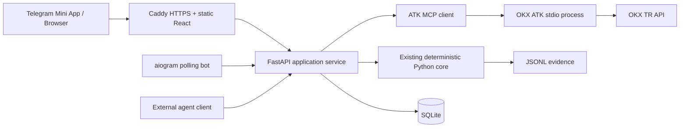

# Agentic Market Intelligence / Trading Copilot — ekosistem ve uygulama kararı

**Araştırma tarihi: 12 Eylül 2026.** Kullanıcının ayrıntılı A–L araştırma talebi esas alınmıştır. Bu belge bir uygulama önerisidir; teknoloji seçiminin onaylandığını veya aşağıdaki ürün bileşenlerinin geliştirildiğini ifade etmez.

**Önerilen yön:** Çalışan deterministik Python çekirdeğinin çevresine React/Vite Telegram Mini App, aiogram botu, ince FastAPI katmanı ve gerçek OKX ATK MCP veri çağrıları eklemek. SQLite ve mevcut JSONL ile saklama; VPS üzerinde Docker Compose ve Caddy. Strateji motorunu veya execution altyapısını başka bir framework'e taşımamak.

## İncelemenin dayanağı ve doğrulama sınırı

Yerel çekirdek, proje durumu, kaynak sicili, Market Structure şartnamesi, ADR 003, paket metadata'sı ve kurulu ATK 1.4.6'nın yayımlanmış JavaScript kodu incelendi. Mevcut uygulamada FastAPI sunucusu, Telegram arayüzü, kendi MCP sunucusu ve dolum/PnL muhasebesi bulunmuyor. FastAPI mevcut altyapının geliştirilmesi için adaydır. `pyproject.toml` çalışma bağımlılığı içermiyor.

Mevcut durum: gerçek OKX **CLI** piyasa adaptörü; 4H/1H/15m kapanmış mumlar; nedensel, değiştirilemez snapshot; Decimal/UTC; SHADOW niyet kaydı; JSONL. Varsayılan sonuç `NO_TRADE / STRATEGY_NOT_CONFIGURED → NO_ACTION`. Bu araştırma sırasında mevcut **36 test geçti**. Bunlar altyapı testleridir; DD stratejisinin performansını doğrulamaz.

Kanıt sınıfları:

| İşaret | Anlamı |
|---|---|
| Belge/kod doğrulaması | Resmi doküman, LICENSE, manifest veya kaynak kodunda görüldü. |
| Yerel doğrulama | Kurulu paket veya mevcut test çalıştırması ile görüldü. |
| Tarihsel smoke | Önceki Phase 1 raporundaki gerçek piyasa sorgusu; bu oturumda tekrarlanmadı. |
| Öneri | Bu projeye ilişkin mühendislik değerlendirmesi; benchmark veya entegrasyon sonucu değil. |
| Doğrulanmadı | Hesap/ürün erişimi, kombinasyon uyumluluğu, telefon performansı veya image dağıtımı çalıştırılmadı. |

Yeni paket kurulmadı; credential dosyaları okunmadı; private hesap/trade çağrısı yapılmadı. Release sayfaları bakım göstergesidir, kapsamlı bakım garantisi değildir. Etiketsiz dal ve doküman URL'leri hareketlidir. Aşağıdaki sürümler **entegrasyon adaylarıdır**; birlikte çözümlenmiş bir lockfile veya test edilmiş dağıtım olarak sunulmamaktadır.

DD kuralı ile dış kaynak ayrımı korunur: Premium/Discount context/confirmation'dır; bağımsız entry tetiklemez. EQ reaction/reclaim genel zorunluluk değildir. Ayrı DD ordinary HTF side-block kuralları korunur. Market Structure N-1–N-7 çözülmeden veya Range kaynağı gelmeden generic SMC kütüphanesiyle boşluklar doldurulmaz.

**Araştırma sırasında gelen kapsam güncellemesi:** Paralel Ch.0 çalışması `product-mvp-v0.1` ürün şartnamesini ve ADR 006–009'u ekledi; kaynak sicili bu raporu [R-COPILOT-001] olarak kaydediyor. O kapsamda Telegram/LLM optional, BTC P0 ve ETH P1; final demo öncesinde **P0.5: onaylı, anlamlı bir deterministik intelligence slice zorunlu**. Aşağıdaki piyasa dashboard'u ara P0 teslimidir; unconfigured sonucu göstermek final intelligence koşulunu karşılamaz. Specific sürüm/deployment önerileri hâlâ test edilmemiş araştırma adaylarıdır. Bu araştırma Ch.1 uygulamasını başlatmaz.

## A. Telegram: tek ana kombinasyon, tek yedek

**Ana kombinasyon: React + Vite + resmi Telegram WebApp köprüsü + aiogram.** FastAPI ile aynı Python ekosisteminde kalır. Vite statik uygulama üretir; frontend için çalışma anında Node sunucusu gerekmez. Bot ayrı süreçte long polling yapar, analizi iç REST API üzerinden ister. Telegram yalnızca ürünün giriş/kimlik/etkileşim yüzeyidir; analiz servisinin bağımsız browser ve agent istemcileri de olabilir.

Resmi `Telegram.WebApp` API'si tema, viewport ve uygulama etkileşimi sunar. İlk sürümde community wrapper zorunlu değil. Tema ve safe-area davranışını gerçek Telegram istemcisinde kontrol etmek gerekir. Native bridge, dağıtılan bir npm paketi olarak değerlendirilmedi; Telegram platform şartları ayrıca geçerlidir. [Resmi Mini Apps API](https://core.telegram.org/bots/webapps).

**Yedek kombinasyon: aynı React/Vite arayüzü + python-telegram-bot 22.8.** Yalnız bot kütüphanesi değişir; veri ve UI katmanları korunur. LGPL yükümlülükleri nedeniyle MIT lisanslı aiogram daha rahat ana seçimdir. İki bot framework'ünü birlikte kullanmayın. [PTB sürümleri](https://github.com/python-telegram-bot/python-telegram-bot/releases), [22.8 metadata](https://raw.githubusercontent.com/python-telegram-bot/python-telegram-bot/v22.8/pyproject.toml).

| Bot adayı | Doğrulanan sürüm / runtime | Lisans | Bu projedeki değerlendirme |
|---|---|---|---|
| [aiogram](https://github.com/aiogram/aiogram) | 3.31.0; Python >=3.10,<3.15; 2026 Ağustos release | MIT | Ana seçim. Async Python botu ve mevcut çekirdeğin dili örtüşüyor; entegrasyon düşük. [Manifest](https://raw.githubusercontent.com/aiogram/aiogram/v3.31.0/pyproject.toml), [LICENSE](https://raw.githubusercontent.com/aiogram/aiogram/v3.31.0/LICENSE). |
| [python-telegram-bot](https://github.com/python-telegram-bot/python-telegram-bot) | 22.8; Python >=3.10 | LGPL-3.0-only | Tek yedek; async uygulama ve polling. Paket kendi lisansını korur. [LICENSE](https://raw.githubusercontent.com/python-telegram-bot/python-telegram-bot/v22.8/LICENSE). |
| [grammY](https://github.com/grammyjs/grammY) | 1.46.0; manifest Node ^12.20.0 veya >=14.13.1 | MIT | Güçlü TypeScript/Node bot alternatifi; Python ağırlıklı bu projede ek runtime yüzeyi. Minimum engine eski; güncel Node 24 kullanılmalı. [Manifest](https://raw.githubusercontent.com/grammyjs/grammY/v1.46.0/package.json), [release](https://github.com/grammyjs/grammY/releases). |
| [Telegraf](https://github.com/telegraf/telegraf) | Release listesi 4.16.3; Node koşulu grammY ile aynı | MIT | Bugün seçmem. Release notlarında v4 destek taahhüdü Şubat 2025'e kadar; 2026 bakım devamlılığı bu incelemede doğrulanmadı. Bu, kesin terk edildi iddiası değildir. [Manifest](https://raw.githubusercontent.com/telegraf/telegraf/v4.16.3/package.json), [release notları](https://github.com/telegraf/telegraf/releases). |

Bu botlar Windows/Linux üzerinde dil runtime'larıyla çalıştırılabilir; Linux container'a paketlenebilirler. Bu tablo her projenin resmi Docker image yayımladığı iddiası değildir. Seçilen botların bu repo ile Windows ve Docker entegrasyonu henüz denenmedi.

**React/Next.js kararı:** Next.js bugün gereksiz. Bu dashboard SEO/SSR gerektirmiyor; API zaten Python'da olacak. React/Vite aynı derlemeyi browser ve Telegram içinde sunar. Ek Node backend, server actions veya React Server Components kurmayın. Community TMA deposunun `telegram-apps` adresi güncel `tma.js` deposuna yönleniyor; eski tutorial paket isimlerini otomatik kurmayın. [Güncel community depo](https://github.com/Telegram-Mini-Apps/tma.js).

Yeni ürün scope'u frontend için TypeScript'i de tercih ediyor. Kısa sürede **TypeScript 6.0.3** klasik JS compiler çizgisi uygun pin adayı; Apache-2.0, Node >=14.17 metadata'sı var, uygulamada Node 24 kullanılmalı. Güncel release listesi 7.0.2 native compiler'ı da gösteriyor; build/toolchain geçişini bugün zorunlu yapmayın. 6.0.3'ün Vite/React tipi kombinasyonu henüz build edilmedi. [6.0.3 manifest](https://raw.githubusercontent.com/microsoft/TypeScript/v6.0.3/package.json), [LICENSE](https://raw.githubusercontent.com/microsoft/TypeScript/v6.0.3/LICENSE.txt), [release listesi](https://github.com/microsoft/TypeScript/releases).

**Kimlik doğrulama:** Ham `initData` backend'e gönderilir. Backend resmi HMAC algoritmasını bot token ile doğrular; `auth_date` yaş sınırını uygular. `initDataUnsafe` kimlik kanıtı değildir. Doğrulanan kullanıcıya kısa ömürlü uygulama oturumu verilir; Telegram verisi her API çağrısında tekrar taşınmaz. İlk self-host demo için yalnız operator Telegram user ID'sine izin verin. Oturum süresi ve replay politikası uygulama ayarıdır, Telegram'ın seçtiği sabitler değildir. [Resmi doğrulama algoritması](https://core.telegram.org/bots/webapps#validating-data-received-via-the-mini-app).

**HTTPS ve localhost:** Normal Mini App üretim URL'si erişilebilir HTTPS olmalı. Browser geliştirme localhost'ta yapılabilir; aynı makinedeki Telegram Desktop koşulları telefonla aynı değildir. Telefondaki `localhost` bilgisayarı göstermez. Telefon demosunda HTTPS tunnel veya domain/VPS gerekir. Ayrı Telegram test ortamı TLS olmadan HTTP'ye izin verir; bu üretim istisnası değildir. Bot long polling için gelen webhook/HTTPS endpoint'i gerekmez. [Telegram test ortamı](https://core.telegram.org/bots/features#testing-your-bot).

## B. Grafik: Lightweight Charts kullanın

**Seçim: TradingView Lightweight Charts 5.2.1.** Mum + birkaç overlay içeren finans ekranı için uygun; strateji tespiti sağlamaz. Lisans Apache-2.0; TradingView attribution ve bağlantı koşulu ürünün görünür bir yerinde yerine getirilmelidir. [Release listesi](https://github.com/tradingview/lightweight-charts/releases), [5.2.1 README](https://raw.githubusercontent.com/tradingview/lightweight-charts/v5.2.1/README.md), [LICENSE](https://raw.githubusercontent.com/tradingview/lightweight-charts/v5.2.1/LICENSE), [NOTICE](https://raw.githubusercontent.com/tradingview/lightweight-charts/v5.2.1/NOTICE).

React içinde kendi küçük adaptörümüz yeterli: ref ile container, bir kez chart oluşturma, effect cleanup'ta `remove()`, yeni kapanmış mumda incremental update. V5 örnekleri kullanılmalı; eski `addCandlestickSeries` örnekleriyle yeni API karıştırılmamalı. Üçüncü taraf React wrapper eklemeyin. [Resmi React örneği](https://tradingview.github.io/lightweight-charts/tutorials/react/simple), [v5 dokümanı](https://tradingview.github.io/lightweight-charts/docs).

| Görsel ihtiyaç | Uygulama önerisi |
|---|---|
| Candlestick / canlı güncelleme | OHLC serisi; geçmişte setData, sonrasında update. Görsel ticker fiyatı ile son kararın kapanış fiyatını ayrı gösterin. |
| Structural High/Low, Range High/Low, EQ | Basit seviyelerde price line; yalnız belirli zaman aralığında geçerli çizgide custom primitive/segment. |
| Premium/Discount bölgeleri | Onaylanmış iki boundary ve EQ'dan türeyen rectangle primitive; hazır SMC detector gerektirmez. |
| Deviation / event marker | İşaretler server evidence ID'sine bağlı; tıklayınca karar/audit paneline gitmeli. |
| swing_time / confirmed_at | Oluşum noktasını ve kullanılabilirlik zamanını farklı sembolle gösterin; replay'de as_of sonrası teyit görünmez. |
| Çoklu timeframe | Tek grafik + 4H/1H/15m selector; context kartları yan/alt panel. İlk gün üç ayrı canlı chart gerekmiyor. |

Custom series ve series/pane primitives uzatma yüzeyleri resmi olarak destekleniyor. Dikdörtgen, bounded çizgi ve hover evidence mantığını bizim adapter kodumuz üretir. [Resmi plugin API](https://tradingview.github.io/lightweight-charts/docs/plugins/intro).

**Bugünkü strateji sınırı:** Gerçek market candles gösterilebilir. Structural seviyeler henüz hesaplanmadığı için “Modül tanımı bekliyor” gösterilir; OHLC'nin maksimum/minimumunu structural diye adlandırmayın. Sonradan eklenen doğrulanmış/manual örnekler ayrı “örnek veri” etiketiyle gösterilebilir; canlı karar kanıtı değildir.

Alternatifler: [Apache ECharts](https://github.com/apache/echarts) Apache-2.0 ve geniş dashboard görselleri için güçlü; [Plotly.js](https://github.com/plotly/plotly.js) MIT ve araştırma grafiklerinde yararlı. İkisi de browser tarafında candlestick sunabilir, fakat bu dar finans ekranına ikinci chart runtime eklemek fayda sağlamaz. **Reference only.** Seçilecek alternatifin sürümü/runtime'ı ayrıca doğrulanmalı; burada kullanım bağımlılığı olarak önerilmediler.

Bu repo üzerinde gzip bundle büyüklüğü, telefon FPS'si veya Telegram açılış süresi ölçülmedi. Paketlerin farklı import/build biçimlerini tek KB rakamıyla karşılaştırmak doğru olmaz. MVP kabul ölçümü: hedef telefonda yaklaşık 1.000 mum, birkaç overlay, resize/dark theme, incremental refresh ve panel açma. Bu sayı benchmark sonucumuz değil, önerilen test yüküdür. Overlay sayısını ve redraw'ı sınırlayın; rendering için Number'a dönüşen Decimal string tekrar çekirdeğin karar/risk girdisine dönmemeli.

## C. Minimum self-host mimarisi

**VPS için üç süreç rolü / üç Compose service:** `api`, `bot`, `caddy`. SQLite ayrı service değildir; frontend Caddy'nin sunduğu statik build'dir. ATK stdio, API container'ının başlattığı Node alt sürecidir; ayrı TCP portu veya ATK database'i gerekmez.

Bot optional Compose profile'da açılmalı: yalnız API + Caddy ile public browser/API ürünü çalışır; Telegram bot token'ının eksikliği core startup'ı bozmaz. Üç rol, üç zorunlu container anlamına gelmez.



Bu diyagram öneridir. API'nin mevcut CLI adaptörü korunur; MCP adaptörü aynı normalizasyon/closed-candle sözleşmesine uyar. Aynı veri bir analizde hem CLI hem MCP ile gereksiz yere iki kez çekilmez. Bir ingestion owner snapshot üretir; REST/MCP/bot aynı application service üzerinden okur. İlk sürüm **tek API worker** ile başlamalı: process içindeki core state ve scheduler çok worker altında kendiliğinden paylaşılmaz.

| Bileşen | Bugünkü karar | Sebep |
|---|---|---|
| Docker Compose | Kullan | Üç service, volume, restart ve health dependency yeterli. |
| Caddy | Kullan | Tek domain'de statik dosya + REST + agent route + otomatik HTTPS. |
| nginx / Traefik | Bugün ekleme | Mevcut hosting zaten kullanıyorsa koruyun; sıfırdan ikinci proxy gerekmez. |
| SQLite | Kullan | Tek host/tek writer ve düşük kullanım için yeterli. |
| PostgreSQL | Sonra | Çok instance, yoğun eşzamanlı yazma veya gelişmiş operasyon ihtiyacında. |
| Redis / Celery | Bugün ekleme | Bounded in-process job + persist edilmiş job durumu ilk demo için yeterli. |

Caddy automatic HTTPS için domain DNS'i sunucuya yönlenmeli; 80/443 erişilebilir ve sertifika storage kalıcı olmalı. Local CA oluşturması bütün telefonların onu güvenilir sayacağı anlamına gelmez. Caddy data/config volume'ları korunur. [Resmi automatic HTTPS şartları](https://caddyserver.com/docs/automatic-https).

Geliştirme: Python API/bot yerel process, Vite dev server ve dev proxy; browser arayüzü localhost. Telegram telefon testi için erişilebilir HTTPS origin. Üretim: Linux VPS + Compose; yalnız Caddy portları public, API iç network'te. Windows'ta Linux container yolu Docker Desktop/WSL2 veya eşdeğer engine kurulumudur. [Resmi Windows gereksinimleri](https://docs.docker.com/desktop/setup/install/windows-install/).

API image hem Python hem Node/ATK içerir; frontend Node'u yalnız build aşamasında kullanır. İmaj derlemesi bu araştırmada yapılmadı. Python image patch/digest ve hedef mimari, ilk build'de doğrulanıp kilitlenmeli; örnek `python:3.13-slim` tek başına immutable pin değildir. Local ATK çalıştırmasında `okx-trade-mcp` executable'ı Windows'ta absolute Node + JS entrypoint ile başlatmak `.cmd`/shell karmaşasını azaltabilir; kullanıcı metni shell komutuna eklenmemeli.

Health: process liveness ile veri readiness ayrılır. `/health/live` ayakta mı; `/health/ready` bootstrap tamam mı/gerekli timeframe'ler geçerli mi; UI ayrıca as_of ve data age gösterir. Stale durum otomatik “WAIT setup” diye çevrilmez. Restart sonrası jobs interrupted olarak işaretlenir veya idempotent veri anahtarıyla devam eder. SQLite ve JSONL volume'ları kalıcıdır; secrets volume'ları UI'dan erişilmez.

Freshness, her timeframe'in beklenen son kapanışıyla değerlendirilir; normal 4H mumunu ticker kadar sık güncellenmediği için stale saymayın. Response observation age ve candle completeness ayrı operational bilgiler olmalı; toleranslar açık config, DD işlem kuralı değildir.

## D. MCP: iki farklı ihtiyacı ayırın

**Birinci öncelik OKX'in MCP sunucusunu gerçekten kullanmak.** Yarışmadaki ATK MCP derinliğine doğrudan katkı sağlar. Kendi MCP sunucumuz diğer agent'ların çekirdeği çağırabilmesi için ikinci adaptördür; yalnız ek tool sayısı üretmek için geliştirilmemeli.

**Python seçimi: resmi `mcp==2.2.0`.** 7 Eylül 2026 release; MIT; Python >=3.10. SDK artık v2 çizgisindedir. V1 içindeki FastMCP sunucu sınıfı v2'de `MCPServer` olarak değişti; eski import'ları kopyalamayın. [Resmi SDK releases](https://github.com/modelcontextprotocol/python-sdk/releases), [2.2.0 manifest](https://raw.githubusercontent.com/modelcontextprotocol/python-sdk/v2.2.0/pyproject.toml), [migration](https://py.sdk.modelcontextprotocol.io/migration/).

Bağımsız `fastmcp` farklı projedir: güncel depo PrefectHQ, görülen release 4.0.3, Apache-2.0, Python >=3.10. Gereksiz provider/proxy/integration yüzeyi olmadan resmi SDK burada yeterli. Bağımsız paket **reference only**; isimleri aynı tarihsel FastMCP ile karıştırmayın. [Repo](https://github.com/PrefectHQ/fastmcp), [release](https://github.com/PrefectHQ/fastmcp/releases), [metadata](https://raw.githubusercontent.com/PrefectHQ/fastmcp/main/pyproject.toml).

| Transport | Nerede kullanılır? | Karar |
|---|---|---|
| stdio | Yerel ATK child process, desktop agent entegrasyonu | ATK veri alma için bugün. stdout yalnız protokol; uygulama logu stderr. |
| Streamable HTTP | Self-host servise uzaktaki agent bağlanması | Kendi sunucumuzun HTTP transport'u. HTTPS + token + host/origin denetimi. |
| Eski HTTP+SSE | Legacy MCP client | Yeni servisin ana transport'u değil. UI SSE akışıyla aynı kavram değil. |

Resmi v2 SDK `Client` üzerinden local/remote bağlantıyı yönetiyor. ATK 1.4.6'nın manifestinde JS MCP SDK ^1.26.0 var. Python v2'nin legacy protokol desteği umut verici; iki paket arasında **initialize → tools/list → gerçek public tools/call** smoke testi yapılmadan interoperability tamamlandı denemez. [V2 client değişiklikleri](https://py.sdk.modelcontextprotocol.io/whats-new/), [ATK MCP manifest](https://raw.githubusercontent.com/okx/agent-trade-kit/github-main/packages/mcp/package.json).

REST + MCP aynı servis içinde temiz biçimde olabilir: application service iş mantığını içerir; FastAPI ve MCP yalnız auth/schema/transport adaptörleridir. Resmi `MCPServer.streamable_http_app()` ASGI app döndürür. `/agent` altında mount ederseniz varsayılan endpoint `/agent/mcp` olur. Host app lifespan'ı `session_manager.run()` yönetmelidir. Public domain için transport host/origin allowlist ayrıca ayarlanır; korumayı kapatmayın. [Resmi ASGI hosting örneği](https://py.sdk.modelcontextprotocol.io/run/asgi/).

En küçük own-MCP MVP: `get_market_state(symbol)` + `explain_decision(analysis_id)`. Aynı snapshot/kararı REST ile eşit içerikle sunar. `analyze_market` job başlatıyorsa dedup/limit gerektirir. `get_active_ranges` çözümlenmemiş modül için NOT_IMPLEMENTED döner. `simulate_trade` yerel state yazar; readOnly tool diye işaretlenmez. `get_risk_state` şu an risk policy yok bilgisini dürüstçe taşır.

Private own-MCP için operator bearer token + read scope; remote token resource/audience doğrulaması. Public third-party dağıtımda standart OAuth discovery/PKCE ve scoped access sonra. Telegram oturumu ile external agent token'ını tek kimlik gibi ele almayın. MCP session ID kimlik doğrulama token'ı değildir; tool annotation güvenlik kontrolü yerine geçmez. [SDK token verifier ve authorization](https://py.sdk.modelcontextprotocol.io/run/authorization/).

Codex stdio ve Streamable HTTP destekliyor; URL bearer token'ı config'e düz yazmak yerine environment referansı sunulabilir. Claude Code da stdio/HTTP ve HTTP OAuth destekliyor. Desktop/cloud ürünlerinin connector izinleri ve paket seçenekleri farklı olabilir; bütün istemciler için evrensel bağlantı sözü vermeyin. [Resmi Codex MCP bağlantısı](https://learn.chatgpt.com/docs/extend/mcp?surface=cli), [Resmi Claude Code MCP](https://code.claude.com/docs/en/mcp).

**Orchestration bugün:** Kendi küçük async coordinator'ımız; symbol allowlist, sınırlı read tools, timeout, analysis ID, step event ve typed snapshot. LangGraph/CrewAI migration'ı yok. Kullanıcının doğal dil isteğini LLM yalnız izinli request şemasına çevirebilir ve kanıtı özetleyebilir; acceptance/risk/işlem izni veremez. LLM provider/model bu talepten belirlenemiyor. Provider yoksa template raporun “LLM agent” diye tanıtılmaması gerekir. Jüriye mevcut gerçek MCP agent istemcisiyle public ATK workflow ayrıca gösterilebilir.

Bu external-client gösterimi product-runtime kanıtının yerine geçmez. İlk acceptance testi backend servisinin kendi MCP client'ından gelen veriyi normalize edip report/core input'a taşımasıdır; dev ortamındaki Codex/Claude bağlantısını başarılı product integration diye saymayın.

## E. Güncel OKX Agent Trade Kit ve TR kapasitesi

Resmi repo default dalı `github-main`. CLI ve MCP paket manifestleri **1.4.6**, MIT, Node >=18; changelog 7 Eylül 2026. Yerel iki paket de 1.4.6. npm paketlerini bu sürüme sabitleyin; install script veya floating latest ile yarışma sırasında yükseltmeyin. GitHub Releases sayfası boş olsa da changelog ve manifest günceldir. [CLI manifest](https://raw.githubusercontent.com/okx/agent-trade-kit/github-main/packages/cli/package.json), [changelog](https://raw.githubusercontent.com/okx/agent-trade-kit/github-main/CHANGELOG.md), [LICENSE](https://raw.githubusercontent.com/okx/agent-trade-kit/github-main/LICENSE).

Repo global modüllerde spot/swap/futures/options/account/earn/bot/event/news/smartmoney listeliyor. Bunlar **ATK'nın araç yüzeyidir**, bizim adaptörümüzde çalıştığı veya TR hesabında kullanılabildiği anlamına gelmez. ATK stdio için `--modules market --read-only --site tr` başlangıç scope'u uygundur. Public market modülü API key gerektirmez. [Resmi repo](https://github.com/okx/agent-trade-kit), [market dokümanı](https://raw.githubusercontent.com/okx/agent-trade-kit/github-main/docs/modules/market.md).

TR durum kodları: **D** = resmi TR API dokümanında endpoint var; **H** = önceki yerel public smoke başarılı; **?** = TR/hesap bazında doğrulanmadı. D, fresh success garantisi değildir. TR routing kod ve config'te `https://tr.okx.com` olarak mevcut. Global domain'e sessiz fallback yapmayın. TR API dokümanında spot/account/public market yüzeyi bulunuyor; global türev/bot/earn kapsamını TR'ye taşımak doğru değil. [Resmi bölge config](https://raw.githubusercontent.com/okx/agent-trade-kit/github-main/docs/configuration.md), [Resmi TR API](https://tr.okx.com/docs-v5/en/).

| Kapasite | CLI 1.4.6 | MCP 1.4.6 adı | Read-only? | Auth | OKX TR | Ürün değeri |
|---|---|---|---|---|---|---|
| Ticker | `market ticker` | `market_get_ticker` | Evet | Hayır | D + H | Güncel fiyat, bid/ask; karar kapanışından ayrı context. |
| MTF candles/history | `market candles --bar ... --after ...` | `market_get_candles` | Evet | Hayır | D + H | 4H/1H/15m bootstrap, pagination, yalnız confirmed mumlar. |
| Order book | `market orderbook --sz ...` | `market_get_orderbook` | Evet | Hayır | D + H | Spread/derinlik/maliyet kanıtı; DD setup yerine geçmez. |
| Instrument metadata | `market instruments --instType SPOT` | `market_get_instruments` | Evet | Hayır | D, bu oturumda çağrılmadı | tickSz/lotSz/minSz; geçersiz miktarı simülasyondan önce engelleme. |
| Trading balance | `account balance` | `account_get_balance` | Evet | Read key/session | D, private smoke yok | İsteğe bağlı operator bakiye farkındalığı. |
| Funding/aggregate balance | `account asset-balance`, `account balance-all` | `account_get_asset_balance`, `account_get_balance_all` | Evet | Read | Funding D; aggregate hesabın alt endpoint'lerine bağlı | İlk gün tüm account türlerini toplama zorunlu değil. |
| Account config | `account config` | `account_get_config` | Evet | Read | D, denenmedi | Hesap yetenekleri; türev desteğini kendi başına ispatlamaz. |
| Fee tier | `account fees --instType SPOT` | **`account_get_trade_fee`** | Evet | Read | D, denenmedi | Gerçek taker/maker fee; yoksa açık etiketli kullanıcı fee varsayımı. |
| Positions/history | `account positions`, `positions-history` | `account_get_positions`, `account_get_positions_history` | Evet | Read | ? Özellikle türev pozisyon anlamı doğrulanmadı | TR spot için holdings balance gösterin; perp paneli kurmayın. |
| Open/order history | `spot orders`, `spot orders --history`, `spot order` | `spot_get_orders`, `spot_get_order` | Evet | Read | D, denenmedi | Daha sonra gerçek emir gözlemi; shadow kayıtlarıyla karıştırılmaz. |
| User fills/archive | `spot fills`, `spot fills --archive` | `spot_get_fills` | Evet | Read | D, denenmedi | Gerçek kullanıcı işlem geçmişi; shadow fill kanıtı değil. |
| Place/cancel/amend | `spot place/cancel/amend` | `spot_place_order`, `spot_cancel_order`, `spot_amend_order` | **Hayır** | Trade | Spot endpoint'leri D; uygulanmadı | Bugünkü demo scope'u dışında. |
| Funding/OI/mark price | `market funding-rate/open-interest/mark-price` | İlgili `market_get_*` tools | Evet | Public | ? TR türev kapsamı doğrulanmadı | Global demo seçilmedikçe eklemeyin. |
| Technical indicators/screeners | `market indicator` ve filtre komutları | `market_get_indicator` ve filtre tools | Evet | Market çoğunlukla public | ? Bazı alt endpoint/ürünler kontrol edilmeli | Yardımcı market bilgisi; DD structure/range yerine geçmez. |
| News/smartmoney/skills | Ayrı modül komutları | Ayrı news/smartmoney/skills tools | Tool bazında | Karışık; smartmoney auth isteyebilir | ? | Skills keşfi iyi DX; haber/leaderboard DD kanıtı değildir. Bugün zorunlu değil. |

**Araç adı konusunda somut drift var:** Account modül dokümanı `account_get_fee_rates` yazarken 1.4.6 kaynak ve yerel bundle `account_get_trade_fee` kaydediyor. Çalışma anında `tools/list` authoritative olmalı. Tarihsel mumlar da ayrı `market_get_history_candles` varsayımıyla kodlanmamalı: güncel candle handler eski zamanları history endpoint'e yönlendiriyor. [Account kaynak kodu](https://raw.githubusercontent.com/okx/agent-trade-kit/github-main/packages/core/src/tools/account.ts), [market kaynak kodu](https://raw.githubusercontent.com/okx/agent-trade-kit/github-main/packages/core/src/tools/market.ts).

Spot dokümanının modül başlığı Read+Trade dese de read handler'ları private GET ve isWrite=false; order/fill okumak için Trade izni talep etmeyin. Writes read-only filtreyle çıkarılır. Hesap okuma/CLI auth ile ayrı client OAuth oturumu aynı kabul edilmez. Hangi profile/site/permission kullanıldığı operator setup ekranında açık olmalı. [Account modülü](https://raw.githubusercontent.com/okx/agent-trade-kit/github-main/docs/modules/account.md), [spot modülü](https://raw.githubusercontent.com/okx/agent-trade-kit/github-main/docs/modules/spot.md).

**Gerçek demo akışı:** Kullanıcı “BTC-USDT analiz et” ister → coordinator public instrument metadata'yı cache'den veya ATK MCP'den alır → MTF candles'ı MCP ile alır → mevcut normalizer kapanmış mumları doğrular → core snapshot/kararı üretir → ticker/book güncel execution context olarak eklenir → UI gerçek tool adı, süre, source/site, as_of ve reason code gösterir. Private yetki varsa Read-only balance/fee aşaması eklenebilir; yoksa aynı public demo eksiksiz çalışır.

Şu an core sonucu strateji tanımı bekleyen NO_TRADE'dir; risk onayı veya otomatik shadow giriş üretilemez. Ayrı manual hypothetical spot senaryosu, minSz/lotSz ve varsayımsal fee ile incelenebilir. Gerçek emir gönderilmez. Jüriye değer, tool sayısı değil: **piyasa verisi → nedensel state → açıklanan karar → ölçülü simülasyon sınırı**. Orderbook daha geç alındıysa zamanı ayrıca kaydedilir; geçmiş kararın o an bilinen girdisiymiş gibi yazılmaz.

## F. Ürün ve rekabet araştırması

Aşağıdaki yedi kaynak seçildi; ilk altı ana karşılaştırma, Financial Datasets küçük MCP referansıdır. “Eksik” sütunu dokümanda görülmeyen bizim hedef özelliğimizi anlatır; projenin hiçbir dalında bulunmadığı iddiası değildir. İyilik/uygunluk ve farklılaşma sütunları mühendislik değerlendirmesidir.

| Ürün | UX / mimari / entegrasyon | Bizim için güçlü ders | Bizim hedefimizden fark |
|---|---|---|---|
| [TradingAgents](https://github.com/TauricResearch/TradingAgents) | LangGraph tabanlı analyst/research/trader/risk rolleri; CLI; çok LLM/data provider, Ollama ve Docker. | Rol adımlarını, fiyat dayanağını ve resume/audit'i görünür yapmak. V0.4.0 özellikle point-in-time ve memory look-ahead düzeltmeleri getiriyor; “rakipler causality düşünmüyor” denmemeli. | LLM çıktıları aynı girdide değişebilir; bizim DD/Decimal kapalı-mum karar çekirdeği ve Telegram finans dashboard'u farklı hedef. [README](https://raw.githubusercontent.com/TauricResearch/TradingAgents/main/README.md), [0.4.0 release](https://github.com/TauricResearch/TradingAgents/releases). |
| [AI Hedge Fund](https://github.com/virattt/ai-hedge-fund) | Güncel 2.2.0 çizgisi interactive/terminal uygulama, investor/alpha modelleri ve backtest; Financial Datasets + LLM API'leri. README persistent fund/paper/live yönüne yeniden yapılanma açıklıyor. | Model ve portföy yaşam döngüsünü somut ürün nesneleriyle anlatmak. | Eski web ekranlarını güncel mimari saymayın. Kendi roadmap'i mevcut live trading kanıtı değil. Bizde crypto ATK, Telegram ve deterministik DD pipeline öncelikli. [Güncel README](https://raw.githubusercontent.com/virattt/ai-hedge-fund/main/README.md), [release](https://github.com/virattt/ai-hedge-fund/releases). |
| [OpenBB / ODP](https://github.com/OpenBB-finance/OpenBB) | Data provider abstraction; Python, REST, MCP ve Workspace/Excel yüzeyleri. Workspace ayrı enterprise UI. | Aynı application/data service'i farklı istemcilere sunma, bağlantı durumunu açıklama. | ODP kodu açık kaynak; enterprise Workspace'i tamamen OSS dashboard diye sunmayın. Bizim dar ATK/DD ürünü için büyük provider platformu fazla. [Ürün ayrımı](https://github.com/OpenBB-finance/OpenBB#openbb-workspace). |
| [Hummingbot](https://github.com/hummingbot/hummingbot) | Crypto exchange connector/strategy/script ekosistemi; terminal ve deployment araçları, paper execution mimarisi. | Connector yaşam döngüsü, order/position event ayrımı, execution hata görünürlüğü. | Execution ağırlıklı; DD stratejisi veya bizim Telegram evidence dashboard'umuzla eşdeğer değil. Framework'e taşınmak kısa yol değil. [Repo](https://github.com/hummingbot/hummingbot), [release](https://github.com/hummingbot/hummingbot/releases). |
| [Freqtrade](https://github.com/freqtrade/freqtrade) | Crypto strateji/backtest/dry-run, Telegram kontrolü ve web UI; CCXT/dataframe ağırlıklı. | Kurulum dokümanı, dry-run durumları, informative timeframe/lookahead kontrolleri. | Güçlü çalışan bot UX'i var. Bizim deterministik servis ve ATK MCP sözleşmesine doğrudan ledger plugin değil; GPL dağıtım koşulları farklı. [Resmi doküman](https://www.freqtrade.io/en/stable/), [release](https://github.com/freqtrade/freqtrade/releases). |
| [Qlib](https://github.com/microsoft/qlib) | ML/quant research, model/data workflow ve RD-Agent ile otomatik araştırma yönü. | Araştırma girdisini, deney ve performans kanıtını versiyonlamak. | Telefon trading copilot'u veya küçük execution ledger'i değil. ML araştırmasını hackathon çekirdeğine taşımayın. [Repo](https://github.com/microsoft/qlib), [release](https://github.com/microsoft/qlib/releases). |
| [Financial Datasets MCP](https://github.com/financial-datasets/mcp-server) | Küçük Python stdio MCP server; finansal tablolar/fiyat/haber için hosted API key. | Tool descriptions, environment setup ve örnek client config sade tutulabilir. | Server OSS olsa da data service self-hosted/ücretsiz olmuyor. Metadata Python >=3.11, README >=3.10 diyor; metadata esas alınmalı. 2026 release/bakım düzeyi doğrulanmadı. [README](https://raw.githubusercontent.com/financial-datasets/mcp-server/main/README.md), [manifest](https://raw.githubusercontent.com/financial-datasets/mcp-server/main/pyproject.toml). |

### Rakiplerin lisans/runtime/bakım kaydı

| Kaynak | Lisans / ticari kullanım | Doğrulanan bakım/sürüm | Runtime / platform / Docker | Karar |
|---|---|---|---|---|
| TradingAgents | **Apache-2.0**, permissive. [LICENSE](https://raw.githubusercontent.com/TauricResearch/TradingAgents/main/LICENSE) | 0.4.0, 31 Ağustos 2026 | Python >=3.10; README Docker/Ollama; Windows düzeltmeleri kayıtlı. Bizimle smoke yok. [Manifest](https://raw.githubusercontent.com/TauricResearch/TradingAgents/main/pyproject.toml) | REFERENCE ONLY; tam entegrasyon yüksek. |
| AI Hedge Fund | MIT. [LICENSE](https://raw.githubusercontent.com/virattt/ai-hedge-fund/main/LICENSE) | 2.2.0, 7 Ağustos 2026 | Python ^3.11; güncel frontend Node minimumu ve resmi Docker yolu doğrulanmadı. [Manifest](https://raw.githubusercontent.com/virattt/ai-hedge-fund/main/pyproject.toml) | REFERENCE ONLY; değişen ürün mimarisi, yüksek migration. |
| OpenBB | AGPL-3.0. [LICENSE](https://raw.githubusercontent.com/OpenBB-finance/OpenBB/develop/LICENSE) | Library 4.7.0 release görüldü; “Latest Desktop” farklı artifact | Core manifest >=3.10,<4; Workspace kurulum metni 3.9.21–3.12 diyor. Kombinasyonu pin/test etmeden uyum varsayılmaz. [Core manifest](https://raw.githubusercontent.com/OpenBB-finance/OpenBB/develop/openbb_platform/core/pyproject.toml) | REFERENCE ONLY; geniş platform + copyleft. |
| Hummingbot | Apache-2.0. [LICENSE](https://raw.githubusercontent.com/hummingbot/hummingbot/master/LICENSE) | Release listesi 2.16.0 | Cython/native bağımlılıklar; kesin güncel Python minimumu bu taramada doğrulanamadı. Linux/container tercih; native Windows entegrasyonu denenmedi. | REFERENCE ONLY; paper engine'i taşımak yüksek. |
| Freqtrade | GPL-3.0; ticari kullanım mümkün, dağıtım yükümlülükleriyle. [LICENSE](https://raw.githubusercontent.com/freqtrade/freqtrade/develop/LICENSE) | 2026.8, Ağustos aylık release | Python >=3.11; Windows/Linux yolları ve Docker dokümanı var. [Tag manifest](https://raw.githubusercontent.com/freqtrade/freqtrade/2026.8/pyproject.toml) | REFERENCE ONLY; strateji/runtime migration yüksek. |
| Qlib | MIT. [LICENSE](https://raw.githubusercontent.com/microsoft/qlib/main/LICENSE) | Release 0.9.7 görüldü; son commit tarihi doğrulanmadı | Metadata Python >=3.8, Win/Linux/macOS; Cython/NumPy build yüzeyi. Docker bu incelemede denenmedi. [Manifest](https://raw.githubusercontent.com/microsoft/qlib/main/pyproject.toml) | REFERENCE ONLY; araştırma için, uygulama dependency'si değil. |
| Financial Datasets MCP | MIT. [LICENSE](https://raw.githubusercontent.com/financial-datasets/mcp-server/main/LICENSE) | Manifest 0.1.0; güncel bakım tarihi belirsiz | Python >=3.11; Win/Linux README; resmi Docker artifact doğrulanmadı | REFERENCE ONLY; ufak server örneği, hosted data şartı. |

**Farklılaşma hipotezi:** OKX ATK MCP verisini kapanmış mumlardan bilinebilir DD state'e taşıyan; chart üzerinde oluşum/teyit ayrımını gösteren; karar ve shadow senaryosunu audit edilebilir yapan taşınabilir self-host copilot. Bu tarama bütün piyasada benzersizlik kanıtlamaz. Farklılaşmanın önemli kısmı henüz uygulanmamış modüllerdedir; bugün çalışan yönümüz causal data pipeline ve intent-only SHADOW'dur.

## G. Explainable agent UI: kendi ince event timeline'ımız

**Bugün önerilen UI bağımlılığı: React'in dışında yeni agent UI runtime'ı yok.** Bir ordered list, durum badge'i, expandable evidence kartı ve tool call drawer yeterli. Akışın şekli sabit, içeriği gerçek event'lerden gelir:

`İstek → ATK veri çağrıları → MTF doğrulama → mevcut modül durumları → Acceptance/Risk → karar → SHADOW sonucu`

Her adım pending/running/succeeded/skipped/failed olabilir. “Market Structure tamamlandı” animasyonu, gerçek modül yokken başarı işareti göstermez. “No valid deviation” yalnız detector gerçekten değerlendirip bu sonucu verdiyse yazılır; şu an doğru ifade “Deviation modülü uygulanmadı”dır.

Önerilen ürün event şeması mevcut core JSONL'yi değiştiren onaylanmış schema değildir:

```json
{
  "analysis_id": "demo-analysis-001",
  "step": "decision",
  "status": "succeeded",
  "as_of": "2026-09-12T09:00:00Z",
  "action": "NO_TRADE",
  "reason_codes": ["STRATEGY_NOT_CONFIGURED"],
  "evidence_refs": [],
  "rule_source_ids": [],
  "validation_status": "NOT_EVALUATED",
  "order_sent": false
}
```

Tool kartı: gerçek tool name, sanitize edilmiş symbol/bar/limit, source site, request/response zamanı, latency, pagination/closed filtering özeti ve error code. Karar kartı: action, reason codes, decision as_of, evidence, source confirmation ve empirical validation durumları. Ham system prompt, model düşünce zinciri, credentials veya bütün private hesap cevabı gösterilmez.

Streaming için **REST job + fetch üzerinden SSE** yeterli; native EventSource keyfi Authorization header taşıyamaz. SSE'yi bearer ile açın veya güvenli cookie oturumunu CSRF/origin kontrolleriyle kullanın. İlk sürüm bearer token'ı yalnız bellekte tutan Mini App session + fetch önerilir. Reconnect'te analysis ID/son event ID ile geçmiş okunur. Basit polling çalışır yedek olabilir; WebSocket zorunlu değil. UI SSE, MCP'nin eski SSE transport'una geçme gerekçesi değildir.

[shadcn/ui](https://github.com/shadcn-ui/ui) MIT kaynak component kalıpları; birkaç card/dialog/tab kopyalamak mümkün, lisans korunmalı. [assistant-ui](https://github.com/assistant-ui/assistant-ui) ve [CopilotKit](https://github.com/CopilotKit/CopilotKit) chat/tool etkileşimi incelemek için yararlı. Bu ikisinin seçilecek paket/sürüm ve tüm lisans katmanları burada doğrulanmadığından **runtime bağımlılığı olarak önerilmiyor**. Geniş agent/chat framework'ü bugün ürünün kapalı-mum kanıtını göstermekten daha öncelikli değil.

## H. Persistence: bugün tam olarak SQLite + JSONL

**SQLite, Python stdlib `sqlite3`, default rollback journal (`DELETE`) ve kısa transaction'lar.** İlk sürüm tek API writer; bot DB'ye doğrudan yazmaz. ORM, Redis ve PostgreSQL kurmayın. Parametreli SQL ve küçük repository sınıfları yeterli. SQLite public domain'dir. [Resmi telif/lisans durumu](https://sqlite.org/copyright.html).

Önemli güncel ayrıntı: resmi SQLite WAL dokümanı, nadir WAL-reset corruption hatasının 3.51.3 ve sonrasında; ayrıca 3.44.6/3.50.7 backport'larında düzeltildiğini bildiriyor. **Yerel Python 3.14.6'nın SQLite runtime'ı 3.50.4 olarak ölçüldü.** Bu nedenle bugünkü başlangıç önerisi WAL değildir. İmajın gerçek `sqlite_version` değeri doğrulanıp yamalı build seçilirse WAL sonradan açılabilir. Mevcut proje henüz SQLite kullanmıyor; bu bulgu mevcut DB'nin bozuk olduğu anlamına gelmez. [Resmi WAL-reset açıklaması](https://sqlite.org/wal.html).

| State | Bugünkü saklama |
|---|---|
| Telegram kimliği / authorization | SQLite user_id, operator role, verified telegram_id; raw initData saklanmaz. |
| Preferences / watchlist | SQLite; küçük limitli JSON alanı veya basit ilişki tablosu. |
| Analysis history | SQLite analysis ID, symbol/site, as_of, status, snapshot fingerprint, çıktı ve evidence references. |
| Job/timeline event | SQLite sıralı event ID; reconnect/restart sonrası okunabilir. |
| Manual paper senaryo / fills | SQLite; user/analysis/model version ve açık hypothetical provenance. |
| Strateji/audit event | Mevcut core JSONL korunur; UI gerekli sanitized event'leri indeksleyebilir. |
| Config | Public/operator config ayrı; secret değeri DB, frontend veya audit payload'a konmaz. |

JSONL audit append/taşınabilir replay için iyi; user preference sorgusu, transaction ve position accounting için tek başına yeterli değil. SQLite kullanıcı/ledger için authoritative store olabilir; core JSONL ayrı engine kanıtıdır. İki store'a yazmak kendiliğinden atomik değildir. Analysis ID/idempotency anahtarıyla ilişkileyin; tam dual-write/outbox garantisi uygulanmadıysa garanti edildi demeyin.

Rollback journal küçük trafikte yeterli olabilir; ölçüm yok. WAL'a geçince de tek writer sınırı ve local filesystem gereği devam eder. Linux named volume kullanın; WAL dosyasını network filesystem'e taşımayın. Backup, açık DB dosyasını tek başına kopyalamak yerine SQLite backup API veya kontrollü offline backup olmalı. [Concurrency/storage sınırları](https://sqlite.org/wal.html).

PostgreSQL ölçek/çok instance ihtiyacında; Redis shared queue/cache veya dağıtık rate limit ihtiyacında değerlendirilir. Bunların bugün yokluğu eksik kurulum değildir. Production'a geçerken deployment ölçümleri kararı belirler; Redis'i lisans koşulları kontrol edilmeden “her sürümü permissive” saymayın.

## I. Paper/shadow: framework yerine küçük ayrı ledger

**Mevcut SHADOW, niyet kaydıdır; paper fill veya PnL değildir.** İlk gün en güvenli ürün, NO_ACTION'ı kanıtıyla gösterir. Paper feature yapılacaksa mevcut core'a ayrı execution simulation adaptörü ve ledger eklenir; DD detector/router değiştirilmez. Manual senaryo, strategy-generated intent ile ayrı provenance taşımalıdır.

| Aday | Öğrenilecek/reuse edilecek parça | Uygunluk / karar |
|---|---|---|
| [bt](https://github.com/pmorissette/bt) | Portföy ağırlıklandırma, transaction/commission ve performans araştırması | Hafif alternatifler içinde araştırmaya uygun, ancak online causal order ledger'i olarak drop-in değil. Manifest 1.2.3, Python >=3.9, MIT. Windows/Linux kurulumu ve native build bu repo ile denenmedi; Docker artifact doğrulanmadı. **REFERENCE ONLY.** [Manifest](https://raw.githubusercontent.com/pmorissette/bt/master/pyproject.toml), [LICENSE](https://raw.githubusercontent.com/pmorissette/bt/master/LICENSE), [release](https://github.com/pmorissette/bt/releases). |
| [LEAN](https://github.com/QuantConnect/Lean) | Fill/fee/slippage modellerinin ayrı arayüzleri, transaction lifecycle | Apache-2.0; C#/Python tam engine. Küçük ledger için büyük migration; güncel .NET/runtime pin'i doğrulanmadı. **REFERENCE ONLY.** [LICENSE](https://raw.githubusercontent.com/QuantConnect/Lean/master/LICENSE). |
| Hummingbot paper connector | Simulated balances/orders ve fill event mimarisi | Kendi connector/clock/event bağımlılıkları nedeniyle birkaç dosyayı takmak yeterli değil. **REFERENCE ONLY.** |
| Freqtrade dry-run | Persist edilmiş trade lifecycle, fee/SL/TP ve restart davranışı | Bizim bağımsız engine'e modül olarak doğrudan takılmaz; GPL. **REFERENCE ONLY.** |
| NautilusTrader | Olay tabanlı order/account/position muhasebesi | Önceki taramada v1→v2 geçişi ve runtime farkları görüldü. **REFERENCE ONLY bugün**, ileride kontrollü pilot. |
| Backtesting.py | Basit komisyon/spread ve next-bar fill örnekleri | Offline OHLC prototipi; AGPL; online ledger migration'ı değil. **REFERENCE ONLY.** [Fill timing API](https://kernc.github.io/backtesting.py/doc/backtesting/backtesting.html). |
| vectorbt | Vektörlü araştırma | Apache-2.0 + Commons Clause; causal execution ve ticari self-host dağıtım hedefi için **REJECT bugün**. [LICENSE](https://raw.githubusercontent.com/polakowo/vectorbt/master/LICENSE.md). |

Önceki Freqtrade/NautilusTrader/Backtesting.py ayrıntıları korunmuştur; bu araştırma bu paketleri yeni dependency olarak önermiyor. Kapsamda mevcut mimariye güvenle doğrudan takılan ve bütün muhasebe/zaman şartlarımızı karşılayan küçük bir kütüphane doğrulanmadı. Bu, böyle bir kütüphanenin ekosistemde bulunmadığı kanıtı değildir.

### Birkaç saatlik ledger sınırı

**Sadece hypothetical spot BUY/SELL**, tek hesap/symbol, Decimal miktar/fiyat ve açık fee/slippage modeli. BUY açılışı ve eldeki varlığı SELL kapatma; perpetual SHORT, margin, liquidation ve funding kapsam dışı. Ürün kartı “varsayımsal spot senaryo” yazar. PnL = net satış tutarı − maliyet − ilgili ücretler; unrealized valuation'ın fiyat türü/zamanı kaydedilir. Gerçek exchange fee yoksa kullanıcı/config varsayımı görünür olur.

Gerekli kayıtlar: scenario/intent, pending order, fill, position/balance ve accounting event. Her fill benzersiz idempotency anahtarıyla bir kez uygulanır; SQLite transaction içinde miktar/balance güncellenir. Position PnL'si chart close'u veya gerçek kullanıcı fill'iyle karıştırılmaz. Exact rounding tickSz/lotSz/minSz'ye göre, gösterimden önce backend'de yapılır.

**Nedensellik kritik:** karar zamanı kapalı mumun kapanışı olsa da karar veri ulaşınca üretilir; bundan önce fill olamaz. Offline replay'de sonraki bar open modeli ancak sıfır gecikme varsayımı açıkça belirtilirse kullanılabilir; live polling'de o open çoğu kez geçmişte kalmıştır. Live hypothetical fill için intent sonrasında gözlenen bid/ask veya sonraki gözlem gerekir. Ayrı `decision_as_of`, `decision_created_at`, `fill_observed_at` ve model version tutulur.

SL/TP aynı mumda ikisi birden görüldüyse OHLC intrabar sıralamayı açıklamaz. İlk sürüm SL/TP'yi tamamen ertelemek veya olayı AMBIGUOUS olarak işaretlemek daha doğru; kazanmış sonucu seçmeyin. Sonradan muhafazakâr açık policy veya granular replay verisi eklenebilir. Bu policy'ler DD source rule değildir; ayrı simulation spec/test kararıdır. Next-open/commission seçeneğinin anlamı için [Backtesting.py resmi API](https://kernc.github.io/backtesting.py/doc/backtesting/backtesting.html) iyi bir karşılaştırmadır.

## J. Güvenlik: hackathon zorunluları ve üretim sertleştirmesi

Bu bölüm mevcut kodda bulunmuş bütün açıkların audit raporu değil; önerilen yeni product boundary'lerinin minimum tasarımıdır. Mevcut uygulamanın exchange order path'i yoktur; yeni UI/MCP bunu bypass edecek genel command endpoint'i açmamalı.

| Kontrol | Hackathon için MUST HAVE | Production hardening |
|---|---|---|
| Exchange permissions | Public demo credentials gerektirmez. Private opsiyonunda yalnız Read; **Withdraw kapalı**, Trade bugün gerekli değil. | Kişi/tenant başına credential ve scope, IP allowlist/rotation/revocation, trade credential izolasyonu. |
| Secret storage | Backend/operator tarafında; .env Git ignore + .env.example boş değerler. UI, LLM input ve JSONL'ye key/passphrase/token yok. | Managed secret store veya encrypted-at-rest vault; erişim/backup/rotation politikası. |
| Docker secrets | File mount ile service bazında secret; uygulama `_FILE` okumayı gerçekten implement etmeli. | Host disk/backup güvenliği; Compose secrets kendiliğinden encrypted vault değildir. |
| Telegram auth | Resmi initData doğrulama + age kontrolü; kullanıcı/operator allowlist. | Session revoke, replay koruması, role/tenant policy; tekrar login ve abuse analizi. |
| User authorization | Her analysis/shadow/history isteğinde ownership kontrolü; private account ekranı yalnız operator. | Multi-user kendi OKX key'ini bağlama akışı, isolation ve permission tests. |
| HTTP/CORS | Public yüzey HTTPS; aynı origin tasarımı; dev CORS açık allowlist. CORS auth değildir. | Cookie varsa CSRF, CSP ve trusted hosts; edge request limitleri. |
| Agent/commands | Symbol/tool allowlist; kullanıcıdan executable/path/URL kabul etme; shell interpolation yok. | Prompt injection/red-team ve outbound URL/SSRF policy, tool provenance. |
| Rate limit/reliability | Kullanıcı analysis quota, bounded job/concurrency, timeout; tek worker'da memory limit uygulanabilir. | Distributed limiter/queue yalnız scale gerektirince; circuit breaker ve recovery/backfill policy. |
| Mode boundary | Default READ_ONLY/SHADOW; live route/tool kayıtlı değil. UI toggle işlem izni sağlamaz. | Ayrı live policy, human confirmation, immutable intent/risk/acceptance kanıtı, kill switch ve idempotency. |
| Audit/log | Sanitized reason/evidence, credential/header redaction; raw initData loglanmaz. | Retention/privacy policy, append integrity, access/export controls. |
| Deployment | API/DB private network, persisted volumes, non-root API image; reload yok. | Image/dependency scans, patch updates, SBOM, restore drills ve monitoring. |

Docker secret dosyaları yalnız izin verilen service'e mount edilir; `_FILE` convention tüm paketlerde otomatik değildir. ATK credential mapping/profile dosyasını repo'ya kopyalamayın; runtime'da backend'e özel bağlayın. [Resmi Compose secrets](https://docs.docker.com/compose/how-tos/use-secrets/).

Browser'a kısa uygulama token'ı döner; OKX token/key dönmez. Header bearer session yalnız bellekte tutulabilir; reload tekrar doğrulama yapar. Cookie seçilirse Secure/HttpOnly/SameSite ve uygun CSRF kontrolleri birlikte gerekir. [OWASP session guidance](https://cheatsheetseries.owasp.org/cheatsheets/Session_Management_Cheat_Sheet.html), [FastAPI CORS](https://fastapi.tiangolo.com/tutorial/cors/).

“Self-hosted” tüm verinin cihazdan çıkmadığı anlamına gelmez: OKX'e request gider; Telegram mesajlarını Telegram işler; dış LLM kullanılırsa seçilen payload o provider'a gider. Raw credentials gönderilmez. Public/operator kurulum ile ileride her kullanıcının kendi hesabını bağladığı çok-tenant ürün arasında açık sınır koyun.

## K. Lisans kararı

**Kendi kodumuz için Apache-2.0 öneriyorum.** MIT de ana permissive bağımlılıklarla uygulanabilir; Apache-2.0 seçimini patent grant ve katkı/NOTICE düzeni için tercih ediyorum. Dependency lisansı kendi dosyalarında korunur; bizim lisansımız üçüncü tarafı yeniden lisanslamaz. Lisans ekleme/değiştirme bu araştırmada yapılmadı. [Apache-2.0 resmi metin](https://www.apache.org/licenses/LICENSE-2.0).

| Sınıf | Kaynaklar | İşlem |
|---|---|---|
| MIT / BSD | React, Vite, aiogram, FastAPI, MCP SDK, OKX ATK; Uvicorn BSD-3-Clause | Ticari/OSS dağıtım mümkün; copyright/license metinleri korunur. Transitive lisanslar lockfile/image aşamasında ayrıca incelenir. |
| Apache-2.0 | Lightweight Charts, Caddy, Compose; referans TradingAgents/Hummingbot/LEAN | LICENSE ve varsa upstream NOTICE; değiştirilmiş kopyalarda değişiklik bildirimleri. Patent/trademark ayrımını koruyun. |
| LGPL | Yedek PTB; referans NautilusTrader | Uygulamanın otomatik GPL olması diye genelleme yok. Library/modification/source ve replacement/relink hakları dağıtım biçimine göre korunmalı. |
| GPL / AGPL | Freqtrade GPL; OpenBB ve Backtesting.py AGPL | Ticari kullanım yasak değildir. Copy/import/modified combined distribution veya ağdan modified AGPL sunma ayrı yükümlülük doğurabilir. Permissive bağımlılık gibi paketlemeyin. |
| Ek restriction | vectorbt Commons Clause | Plain Apache/permissive OSS değil; özellikle değeri büyük ölçüde ondan türeyen ticari servis/ürün koşulları sorun yaratabilir. Runtime'a almayın. |
| Platform/data | Telegram, OKX API, Financial Datasets ve LLM provider | Server code lisansı API data, marka ve service terms hakkı vermez; kullanıcıya self-host yazılım ile external service ayrımını anlatın. |

Copyleft “bir link vermek tüm repo'yu bulaştırır” diye açıklanmaz. Mimari fikirleri bağımsız uygulamak ile kaynak dosyayı kopyalamak farklıdır. Ayrı process/API sınırı da her lisans yükümlülüğünü kendiliğinden kaldırmaz; bağlı/dağıtılan eser somut olarak değerlendirilir. Ana öneri GPL/AGPL kaynak kodunu runtime'a taşımıyor.

Özel dikkat: Lightweight Charts görünür TradingView attribution + link ister; sadece GitHub LICENSE koymak yetmeyebilir. `THIRD_PARTY_NOTICES` ve UI footer/about link'i planlanmalı. Windows geliştirme için Docker Desktop'ın ticari subscription şartları, Apache lisanslı Compose plugin'den ayrıdır; Linux engine self-host kurulumu farklı dağıtım yüzeyidir. [Charts README şartları](https://raw.githubusercontent.com/tradingview/lightweight-charts/v5.2.1/README.md), [Docker Desktop lisansı](https://docs.docker.com/subscription-billing/desktop-license/).

## L. README / Developer Experience

README ürün vaadi ile çalışan durumunu yan yana göstermeli. Kullanıcı “veri pipeline çalışıyor” ile “DD stratejisi işlem açabiliyor”yu ilk dakikada ayırt etmeli. Freqtrade'ın kurulum/mod/stage dokümanı ve küçük Financial Datasets MCP client setup'ı sade örnekler; OpenBB'nin surface ayrımı da backend/Telegram/agent bağlantısını anlatmada yararlı. Bunların komutlarını doğrulamadan kopyalamayın.

Önerilen README sırası:

1. Bir cümle ürün tanımı, dashboard screenshot veya kısa demo, current/planned tablosu.
2. Yukarıdaki mimari, Telegram'ın frontend; core/API'nin bağımsız olduğu açıklaması.
3. Requirements: Python, Node, Docker/Compose; Windows/WSL2 ve Linux yolları.
4. Docker quick start: clone → `.env.example` kopyala → operator/bot/domain ayarla → compose → health → UI. **Bu quick start bugün uygulanmış değildir.**
5. Local browser development, ardından gerçek telefonda Telegram HTTPS testi.
6. BotFather bot/menu button/web app URL ve operator Telegram ID setup.
7. OKX public no-key mode, TR/global site seçimi; optional Read credentials ve izin sınırları.
8. ATK MCP bağlantısı ve opsiyonel kendi MCP endpoint/client config; secret değerleri environment referansı.
9. READ_ONLY / intent-only SHADOW / hypothetical paper / future LIVE farkları; live bugün yok.
10. Closed candle, UTC, Decimal, as_of/swing_time/confirmed_at ve DD source-vs-validation sözleşmesi.
11. Strategy modules + unresolved spec bağlantıları; NOT_IMPLEMENTED durumlarının anlamı.
12. Tests/CI, reproducible demo fixture, sanitized logs; troubleshooting: HTTPS/auth/site/data freshness.
13. Security, backup/restore/update, license/attribution, contributing ve küçük roadmap.

Runtime `.env`, credential profile ve private data hariç tutulsun. `.env.example` yalnız boş/demo değerler; optional fields ile minimum public setup ayrılır. `EXECUTION_MODE=SHADOW`, `OKX_SITE=tr`, operator allowlist ve model/provider opsiyonları açık tanımlansın. Varsayılan values gerçek acceptance/risk policy uydurmasın.

İlk çalışan Docker sürümünün README kabulü: fresh Linux checkout'tan start, health ve Telegram auth; Windows dev yolu ayrı; secrets'siz public demo; restart sonrası analysis/ledger durumu; kendi MCP için external client smoke. Bunlar önerilen kontroller, bu araştırmada geçmiş testler değildir. README'nin `docker compose up -d` iddiası image build ve hedef host testinden sonra yazılmalı.

## Sürüm ve runtime kanıt özeti

Bu tablo **doğrudan kullanılması önerilen** paketleri kapsar; npm/Python tüm transitive bağımlılıklarının lisans veya wheel audit'i değildir. Docker support iki anlamda ayrılır: resmi binary/image mevcut olması ile bizim uygulama image'ına paketlenebilir olmak.

| Paket / rol | Pin adayı, bakım | Runtime | Windows/Linux/Docker | Lisans / kaynak | Maliyet |
|---|---|---|---|---|---|
| React / UI | **19.3.0**, 9 Eylül 2026 release; react-dom aynı sürüm | Browser; builder Vite runtime'ına bağlı | Browser iki OS; build→static Docker | [MIT LICENSE](https://raw.githubusercontent.com/react/react/v19.3.0/LICENSE), [releases](https://github.com/react/react/releases) | Düşük/orta UI işi |
| Vite / build | **8.3.0**, 10 Eylül 2026; create-vite sürümü ayrı artifact | Node ^20.19.0 veya >=22.12.0 | Win/Linux builder; runtime Node server gerekmez | [Manifest](https://raw.githubusercontent.com/vitejs/vite/v8.3.0/packages/vite/package.json), [MIT LICENSE](https://raw.githubusercontent.com/vitejs/vite/v8.3.0/LICENSE), [release](https://github.com/vitejs/vite/releases) | Düşük |
| TypeScript / typecheck | **6.0.3** pin adayı; güncel native 7.0.2'ye bugün migration şart değil | Node >=14.17 package minimum; Node 24 tercih | Win/Linux JS compiler; Docker build aşaması, smoke pending | Apache-2.0; A bölümündeki tag/license | Düşük; yeni native toolchain ertelenir |
| Node / builder + ATK runtime | **24.20.0 LTS**, 26 Ağustos 2026 doğrulanan release adayı | Node binary; Python bağımlılığı yok | Resmi release Win/Linux artifacts; image digest pending | [Repo](https://github.com/nodejs/node), [MIT + bundled third-party LICENSE](https://raw.githubusercontent.com/nodejs/node/v24.20.0/LICENSE), [release](https://nodejs.org/en/blog/release/v24.20.0) | Mevcut host 24.15.0 değiştirilmedi |
| CPython / backend runtime | Proje >=3.11; host 3.14.6 suite geçti; yeni image 3.13 çizgisi adayı, exact patch/digest build'de doğrulanacak | Python binary; Node yalnız ATK için | Win host doğrulandı; Linux image kombinasyonu pending | [Repo](https://github.com/python/cpython), [PSF ve bundled lisans metinleri](https://docs.python.org/3.13/license.html); ticari kullanım mümkün, notices korunmalı | Host değişikliği yok; Linux smoke gerekli |
| aiogram / bot | **3.31.0** | Python >=3.10,<3.15 | Native Win/Linux mümkün; kendi Linux image'ımız, smoke pending | MIT; A bölümündeki tag/license | Düşük |
| FastAPI / REST | **0.141.1**, release listesi güncel | Python >=3.10; core minimumu >=3.11 kalır | Win/Linux; kendi Python image'ımız | [Tag metadata](https://raw.githubusercontent.com/fastapi/fastapi/0.141.1/pyproject.toml), [MIT LICENSE](https://raw.githubusercontent.com/fastapi/fastapi/0.141.1/LICENSE), [releases](https://github.com/fastapi/fastapi/releases) | Orta: auth/job adaptörü |
| Uvicorn / ASGI | **0.52.4** | Python >=3.10 | Win/Linux; bare paket seçilir, Windows için uvloop zorunlu yapılmaz | [Metadata](https://raw.githubusercontent.com/Kludex/uvicorn/0.52.4/pyproject.toml), [BSD LICENSE](https://raw.githubusercontent.com/Kludex/uvicorn/0.52.4/LICENSE.md), [release](https://github.com/Kludex/uvicorn/releases) | Düşük |
| Lightweight Charts / chart | **5.2.1**, Ağustos release | Browser JS; uygulama build'i Node | Win/Linux browser; static build; telefon smoke pending | Apache-2.0 + attribution; B bölümündeki tag/license | Orta: custom overlay |
| MCP SDK / client + own server | **2.2.0**, 7 Eylül 2026 | Python >=3.10 | Win/Linux; stdio/ASGI container; ATK interop pending | [MIT LICENSE](https://raw.githubusercontent.com/modelcontextprotocol/python-sdk/v2.2.0/LICENSE), D bölümündeki metadata/release | Orta, transport/lifespan |
| OKX CLI + MCP | **@okx_ai/okx-trade-cli@1.4.6**, **@okx_ai/okx-trade-mcp@1.4.6**, 7 Eylül | Node >=18; EOL Node 18 önerilmiyor | Yerel Windows kurulu; Linux Node image'a paketlenir, dağıtım smoke pending | MIT; E bölümündeki manifest/changelog/license | CLI mevcut; MCP adaptörü orta |
| SQLite / DB | Python stdlib; **runtime sqlite_version kaydedilir**, ayrı pip paketi yok | Python sqlite3; bugün rollback journal | Win/Linux; Linux local volume | Public domain; H bölümündeki source | Düşük |
| Caddy / HTTPS | **2.11.4**, release listesi | Go binary; Node/Python bağımlılığı yok | Linux image hedef; native Win binary ayrı yol | [Apache LICENSE](https://raw.githubusercontent.com/caddyserver/caddy/v2.11.4/LICENSE), [releases](https://github.com/caddyserver/caddy/releases) | Düşük + DNS/VPS |
| Docker Compose / deploy | **5.5.1** görülen release; installed compatible plugin de yeterli, yeni upgrade şart değil | Docker Engine + Compose CLI plugin | Linux VPS; Win Linux-container setup WSL2/engine | [Apache LICENSE](https://raw.githubusercontent.com/docker/compose/main/LICENSE), [releases](https://github.com/docker/compose/releases) | Düşük/orta ilk image |

Host runtime kanıtı: Python **3.14.6**, Node **24.15.0**, SQLite **3.50.4**. Bunlar yerel ölçüm; “en yeni güvenlik patch'i” iddiası değil. Node 24.15.0 resmi LTS release olarak da doğrulandı. Yeni Linux image için Python 3.13 çizgisi makul adaydır; mevcut host 3.14.6 değiştirilmez. Deploy sırasında seçilen Python/Node güncel security patch ve image digest'i doğrulanmalıdır. [Node 24.15.0 resmi release](https://nodejs.org/en/blog/release/v24.15.0).

Ana paketlerin permissive lisansları ticari/açık kaynak kullanıma uygundur; attribution/NOTICE ve transitive lisanslar korunur. Bütün kombinasyon için Python lockfile, npm lockfile ve image digest henüz üretilmedi. Sadece dependency version pin'i, transitive resolver veya runtime güvenlik doğrulaması değildir.

## 1. TOP 10 ACTIONABLE FINDINGS

1. **Çekirdeği koruyun.** Bir API application service'i çevresine UI/bot/MCP adaptörleri ekleyin; strateji framework'üne taşımayın.
2. **React/Vite + aiogram ana seçim.** Tek yedek PTB; Next.js ve ek bot Node service'i bugün gerekmiyor.
3. **Lightweight Charts 5.2.1 kullanın.** Kendi React adaptörümüz ve görünür TradingView attribution yeterli başlangıç.
4. **ATK çağrılarını gerçekten MCP'den geçirin.** Mevcut CLI kullanımı tek başına MCP integration demo'su değildir; protocol/tool-call kanıtını gösterin.
5. **1.4.6 tool schemas'ını keşfedin.** Fee tool adı dokümandaki isimden farklı; tools/list + actual public call smoke ilk kapıdır.
6. **TR spot/public ile başlayın.** BTC/ETH public data + instrument constraints + book context; global perp/earn/bot desteği vaat etmeyin.
7. **Strateji boşluğunu üründe açık gösterin.** NOT_IMPLEMENTED, NO_TRADE/STRATEGY_NOT_CONFIGURED ile NO_VALID_SETUP aynı anlam değil.
8. **SQLite + JSONL yeterli.** Yerel SQLite 3.50.4 için başlangıçta rollback journal; WAL yalnız patched runtime doğrulanınca.
9. **Telefon HTTPS ve server-side auth ilk günden.** Operator allowlist + ownership; private credential browser/model/log'a gitmez.
10. **Causal audit'i skor özelliğine dönüştürün.** as_of, source/site, tool zamanı, reason/evidence ve gelecekte occurrence/confirmation ayrımı; CoT veya sahte confidence skoru yok.

## 2. RECOMMENDED HACKATHON STACK

| Alan | Kesin öneri |
|---|---|
| Frontend | React 19.3.0 + react-dom aynı sürüm; Vite 8.3.0 + TypeScript 6.0.3 pin adayı, statik SPA; Node 24.20.0 LTS. İlk build'de lock/digest doğrula. |
| Telegram | Resmi WebApp bridge + aiogram 3.31.0; ayrı polling bot. Tek fallback PTB 22.8. |
| Backend | Mevcut Python core + FastAPI 0.141.1 + Uvicorn 0.52.4; tek ingestion owner / API worker. |
| Charts | Lightweight Charts 5.2.1; kendi küçük adapter/primitive; attribution link. |
| Persistence | sqlite3 + SQLite rollback journal; users/analyses/events/manual ledger. Core JSONL korunur. |
| Deployment | Docker Compose: api + caddy; bot optional profile. Statik frontend; ATK API container'ında stdio child. |
| HTTPS | Domain/VPS üzerinde Caddy 2.11.4; dev phone testinde erişilebilir HTTPS origin. |
| MCP | Resmi mcp 2.2.0 client ile ATK; own MCP iki read tool ancak REST/demo çalışınca. Remote için Streamable HTTP. |
| OKX | Kurulu resmi CLI/MCP 1.4.6; market + read-only + site tr. Private balance/fee tamamen optional. |
| Testing | Mevcut 36 unittest; entegrasyon eklendiğinde auth/ownership, MCP interop, decimal/causal input ve duplicate fill için anlamlı testler; gerçek Telegram telefon smoke. |
| Logging | Mevcut JSONL schema v2; yeni product events ayrı sürümlü/sanitized schema, analysis ID correlation; özel CoT yok. |

Agent orchestration: kendi bounded async coordinator + seçilecek provider adaptörü. Provider/model bu araştırmada seçilmiş değildir. Deterministik decision, acceptance, risk ve mode sınırı LLM'den bağımsızdır.

## 3. DEPENDENCY MATRIX

Durumlar bu araştırmanın önerileridir; kurulum yetkisi veya yapılmış entegrasyon değildir. Runtime/license kanıtı ana tablo ve A/F/I bölümlerindedir. **REJECT** burada bugünkü hackathon scope'u içindir, projenin genel kalitesine hüküm değildir.

| Aday | Durum | Depend / reference | Neden |
|---|---|---|---|
| React + Vite | **USE NOW** | DEPEND | Aynı statik UI Telegram/browser; SSR sunucusu gerektirmez. |
| TypeScript / Node 24 LTS | **USE NOW** | BUILD / RUNTIME | Yeni frontend scope'u; klasik TS compiler, ATK runtime. Pins A/kanıt tablosunda. |
| Telegram official API/bridge | **USE NOW** | PLATFORM API | Auth/theme/viewport için resmi yüzey; wrapper zorunlu değil. |
| aiogram | **USE NOW** | DEPEND | Mevcut Python backend ile düşük entegrasyon. |
| python-telegram-bot | **REFERENCE ONLY** | TEK FALLBACK | aiogram engellenirse onun yerine; LGPL koşullarıyla. |
| FastAPI + Uvicorn | **USE NOW** | DEPEND | Core'a ince auth/job/REST adaptörü. |
| Lightweight Charts | **USE NOW** | DEPEND | Mum ve kanıt overlay; lisans/attribution korunarak. |
| Official MCP Python SDK | **USE NOW** | DEPEND | ATK client; opsiyonel küçük own server için aynı SDK. |
| OKX ATK CLI + MCP | **USE NOW** | DEPEND | CLI mevcut; authentic MCP demo için ek adapter. |
| SQLite / sqlite3 | **USE NOW** | STDLIB | Tek host/writer; küçük state ve ledger transaction'ları. |
| JSONL | **USE NOW** | OWN EXISTING | Çalışan engine evidence; DB yerine her işi yapmaz. |
| Compose + Caddy | **USE NOW** | DEPLOY DEPEND | Minimum VPS/HTTPS ve persisted volumes. |
| shadcn/ui | **REFERENCE ONLY** | OPTIONAL SOURCE | Gerekirse birkaç component; bütün scaffold/runtime migration yok. |
| grammY | **REFERENCE ONLY** | REFERENCE | TypeScript bot dünyası için güçlü; bu ürün Python ağırlıklı. |
| tma.js / standalone FastMCP | **REFERENCE ONLY** | REFERENCE | Mevcut minimum ihtiyaç resmi API/SDK ile karşılanıyor. |
| assistant-ui / CopilotKit | **REFERENCE ONLY** | REFERENCE | UI patterns; sürüm/lisans katmanları doğrulanmadan kurulum yok. |
| ECharts / Plotly.js | **REFERENCE ONLY** | REFERENCE | Daha geniş research dashboard ihtiyacında; bugün ikinci chart değil. |
| TradingAgents / AI Hedge Fund / OpenBB / Qlib / Financial Datasets MCP | **REFERENCE ONLY** | PRODUCT REFERENCE | UX/orchestration/README dersleri; DD strategy truth veya runtime değil. |
| Freqtrade / Hummingbot / LEAN / bt / Backtesting.py / NautilusTrader | **REFERENCE ONLY** | EXECUTION REFERENCE | Lifecycle/fill/accounting tasarımı; framework migration yok. |
| PostgreSQL / shared queue | **USE LATER** | REVALIDATE FIRST | Çok instance/ölçülen contention olunca sürüm/lisans/runtime seçiminden sonra. |
| Full portfolio analytics/backtest | **USE LATER** | REVALIDATE FIRST | Onaylı strategy + causal ledger + yeterli veri sonrası. |
| Next.js / Telegraf v4 / Traefik veya nginx ek katmanı | **REJECT** | TODAY | Ek runtime/proxy veya maintenance belirsizliği; mevcut ortamda kurulmuşsa otomatik sökme önerisi değil. |
| Redis/Celery ek service | **REJECT** | TODAY | Tek worker demo için gerekçe yok; Redis lisansı sürüm bazlı kontrol ister. |
| vectorbt runtime | **REJECT** | TODAY | Commons Clause ve batch/precision/causal execution uyum yükü. |
| Generic SMC detector'ı DD yerine koymak | **REJECT** | SEMANTIC SUBSTITUTION | Kaynak/doğrulama ve live availability sözleşmesini karşılamaz. |

## 4. BUILD VS BORROW MATRIX

| Alan | Bizim kodumuz | Kütüphane / referans |
|---|---|---|
| DD structure/range/deviation/context | Onaylı spec'ten deterministic engine; açık pending tanımlar | Dış SMC yalnız karşılaştırma, DD doğrusu değil. |
| ATK veri adaptörü | Snapshot normalization, closed filter, site/provenance/time sözleşmesi | Resmi ATK + official MCP client. |
| Decision/acceptance/risk | Bağımsız deterministic policy; LLM izin vermez | Rakiplerden state/event tasarım dersi. |
| Telegram login/authorization | Resmi algoritma doğrulaması, session, operator/ownership policy | Official Telegram API + aiogram; vetted helper seçilirse audit/pin. |
| Chart rendering | Backend evidence→overlay adapter, confirmation görünürlüğü | Lightweight Charts rendering API. |
| Agent timeline | Sanitized product event schema + cards/coordinator | React/CSS; shadcn source pattern optional. |
| Paper accounting | Ayrı küçük Decimal spot ledger + causal fill spec | bt/LEAN/Hummingbot/Freqtrade reference; engine taşınmaz. |
| Persistence | Parametreli repository/query ve transaction sınırı | stdlib sqlite3; mevcut JSONL. |
| REST / own MCP | Tek application service'e ince schema/auth adaptörleri | FastAPI/Uvicorn + official MCP SDK. |
| HTTPS/deployment | Küçük Compose/Caddy config ve tested README | Caddy automatic TLS ve Docker runtime. |

## 5. BIGGEST TECHNICAL RISKS

| Risk | Etki | İlk azaltma |
|---|---|---|
| Strateji semantiği çözülmemiş | Gerçek LONG/SHORT, structural overlay veya valid range vaadi karşılanmaz | Modül durumunu açık göster; source ingestion devam; manual senaryoyu ayrı etiketle. |
| MCP v1/v2 ve schema drift | Demo initialize/tool call sırasında bozulur | SDK pin + tools/list + bir gerçek public call; fee adı koddan doğrulanır. |
| TR/global ürün ve auth farkı | Geçersiz instrument/private 401 veya yanlış dataset | Explicit site tr; spot instruments keşfi; private aşama optional. |
| Multiworker/process state | Aynı kapanış iki kez değerlendirilir veya stale state okunur | Tek owner/worker; per symbol serialization + idempotent analysis key. |
| Offline label → live state veya geriye fill | Sahte causal sonuç/PnL | confirmed_at/as_of filtre, observed fill time; next-open varsayımı açık. |
| UI/WebView HTTPS/auth | Telefon demosu açılmaz veya kullanıcı kimliği taklit edilir | Gerçek telefonda erken smoke; verified initData + operator allowlist. |
| Orderbook/context zaman farkı | Sonradan çekilen bilgi geçmiş decision evidence olur | Snapshot decision girdisi ile sonrasındaki execution context ayrılır. |
| DB/JSONL crash ve duplicate fill | Ledger ya da audit bağlantısı tutarsız | Transaction/idempotency; rollback journal; iki store atomiklik sınırını açık tut. |
| LLM/tool output güven sınırı | Arbitrary command/live permission veya yanlış karar özeti | Read allowlist + typed request + server risk/mode gate; template kanıta bağlı. |
| Build/runtime ve mobile perf denenmemiş | Paket kombinasyonu/image/bundle demo sırasında başarısız | İlk thin slice erken build; hedef host/phone smoke; lockfile/digest kaydı. |

## 6. LICENSING RISKS

1. Lightweight Charts Apache lisansına ek attribution/link şartı: ürün UI'ında görünür biçimde yerine getir.
2. Freqtrade GPL; OpenBB/Backtesting.py AGPL: bugün kaynak/runtime taşıma yok. Reference link'i ile copy/import aynı şey değildir.
3. PTB LGPL fallback: library notices/source/replacement haklarını dağıtım modeline uygun koru.
4. vectorbt Commons Clause: ticari/açık kaynak hedefte plain permissive paket gibi kabul etme.
5. Apache dependency NOTICE ve MIT/BSD copyright korunmalı; kendi LICENSE tek başına yeterli olmaz.
6. Compose OSS lisansı Docker Desktop subscription, OKX/Telegram/data service şartları veya TradingView markasını kapsamaz.
7. Doğrudan aday lisansları incelendi; bütün transitive lockfile/image SBOM incelemesi yapılmadı. Release paketi oluşunca tamamlanmalı.

## 7. OPEN-SOURCE PROJECTS WORTH STUDYING

| Öncelik | Kaynak | Okuma amacı |
|---|---|---|
| 1 | OKX Agent Trade Kit 1.4.6 kaynak/manifests | Actual tool schemas, historical candles, read-only filtre ve TR routing. |
| 2 | MCP Python SDK 2.2.0 examples/migration | ASGI lifespan, Client, authorization ve legacy negotiation. |
| 3 | Lightweight Charts 5.2.1 React/plugin examples | Kendi component/overlay adapter'ı ve cleanup/live update. |
| 4 | TradingAgents 0.4.0 | Point-in-time data, audit/resume ve fiyat dayanağı; karar üretimine migrate etme. |
| 5 | Freqtrade 2026.8 | Dry-run UX, setup docs ve MTF/lookahead kontrol yaklaşımı. |
| 6 | Hummingbot / LEAN | Event/account/fill separation; source copying yerine küçük kendi ledger tasarımı. |
| 7 | OpenBB + Financial Datasets MCP | Aynı backend'i farklı yüzeylere sunma ve sade external client setup. |
| 8 | AI Hedge Fund 2.2.0 / Qlib 0.9.7 | Uzun vadeli portfolio/model araştırma lifecycle'ı; bugün uygulama dependency'si değil. |

Doğrudan repo/license/release bağlantıları D–F/I ve sürüm tablosunda bulunur. Bakım/runtime belirsizliği bulunan reference'lar entegrasyon adayına çevrilmeden yeniden doğrulanmalı.

## 8. WHAT NOT TO BUILD TODAY

- Yeni trading framework migration'ı, adaptive scanner, optimizer veya generic SMC ile DD boşluklarını doldurma.
- Çözülmemiş structure/range tanımından canlı seviyeler, confidence skoru veya kârlılık iddiası.
- Gerçek trading, withdraw/transfer, autonomous execution veya live-mode UI switch'i.
- TR'de doğrulanmamış perpetual SHORT, funding/liquidation, earn/grid/event ürünleri.
- PostgreSQL/Redis/Celery/Kubernetes, ikinci reverse proxy, full Next.js/SSR backend.
- Full portfolio/backtest, OHLC'den kesin intrabar SL/TP sonucu, private LLM CoT gösterimi.
- Aynı veriyi tool sayısı artırmak için CLI+MCP'den tekrar tekrar çekmek.
- Her Telegram kullanıcısına operator OKX hesabını göstermek veya multi-tenant vault'u birkaç saatte tamamlandı saymak.
- REST/demo çalışmadan altı own-MCP tool ve büyük agent framework'ü.

## 9. THREE FEATURES — jüri skoruna en çok katkı

Puan artışı ölçülmüş sonuç değil, verilen ağırlıklara göre öncelik değerlendirmesidir.

| Feature | Somut kullanıcı değeri | İlgili skor |
|---|---|---|
| **Market cockpit** | BTC/ETH selector, mobil candlestick, MTF kapalı-mum/as_of kartı, karar ve açıklama aynı ekranda; yapılmamış modül için açık durum | Utility %30 + UX %30. İşlem açmadan da gerçek veri faydası; ilk öncelik. |
| **Görünür authentic ATK MCP run** | Gerçek instrument/candles/book tool adımları; site/time/latency/evidence; deterministik sonuç ve NO_ACTION sonu | ATK %20 + Reliability %10 + UX. Tool çağrısının ürün sonucuna neden katkı verdiği anlaşılır. |
| **Causal evidence / shadow lab** | Analysis audit replay; o anda bilinen bilgi; işlem gönderilmedi kanıtı. Zaman kalırsa ayrı manual spot senaryoda metadata/fee/observed fill | Innovation %10 + Reliability + Utility. Şimdi event/audit; actual structural confirmed_at overlay yalnız onaylı modül çıkınca. |

Mevcut modüllerle üçüncü feature'ın “o anda bilinen kapanmış snapshot + immutable decision record” kısmı yapılabilir. “4H structure bullish / price below structural EQ / valid deviation” ancak ilgili modül gerçek evidence üretince gösterilebilir. Güncel hackathon farkını yapılmamış strateji üzerinden vaat etmeyin.

## 10. FINAL RECOMMENDATION

**Yalnız birkaç saatim olsaydı, önce P0'ın uçtan uca market intelligence yüzeyini çalıştırır, final-demo P0.5 intelligence kapısını ayrıca korurdum.** Çalışan core'u yeniden yazmadan gerçek piyasa, Telegram dashboard ve gerçek ATK MCP kullanımını birleştirirdim. Onaylı dar bir intelligence slice ve causal fixture mevcutsa final demo için onu bağlardım; tanım yoksa eksik koşulu açık kaydederdim. Aşağıdaki süreler önerilen timebox'tır; yapılmış işler veya kesin süre garantisi değildir.

| Sıra / timebox | Yapılacak somut iş | Bitti ölçütü |
|---|---|---|
| 1 — 0–40 dk | ATK 1.4.6 stdio + mcp 2.2.0 initialize/tools/list; ticker veya candles public call. Aynı normalizer'a ince adapter. | tools/call gerçekten çalışır; tr source, sanitized event ve Decimal/closed sözleşmesi korunur. Interop aksarsa bu kapıda çöz; sahte MCP badge koyma. |
| 2 — 40–90 dk | FastAPI tek worker + application service; analyze job, state/history ve product event endpoint; SQLite rollback journal. | Bir symbol analizi mevcut gerçek NO_TRADE sonucunu aynı analysis ID altında verir; duplicate job kontrolü. |
| 3 — 90–170 dk | React/Vite ekran: selector, Lightweight chart, decision/data freshness ve timeline/evidence. | Browser'da gerçek BTC/ETH veri gösterimi; NOT_IMPLEMENTED doğru; attribution görünür. |
| 4 — 170–215 dk | aiogram /analyze ve Mini App butonu; initData auth/operator allowlist; erişilebilir HTTPS. | Gerçek telefonda açılır; wrong/stale auth ve başka kullanıcının history erişimi reddedilir. |
| 5 — 215–260 dk | Compose/Caddy thin deployment; persisted analysis/audit; README public setup; timeout/error states. | Hedef host start/health/restart ve phone smoke geçer; existing 36 test yeşil; order_sent false. |
| Final-demo kapısı — optional feature'lardan önce | P0.5 için önceden onaylı dar intelligence spec/fixture varsa uygula/bağla; yoksa gerekli DD kaynak/definition eksikliğini kaydet. | Gerçek anlamlı deterministic evidence; placeholder'ı WAIT diye yeniden adlandırmak, manual paper veya veri kalite kartı kapıyı karşılamaz. Süresi tanım/iş kapsamına bağlı; bu tabloda garanti edilmez. |
| 6 — kapılar tamam ve yalnız süre kalırsa | Own-MCP iki read tool **veya** küçük manual hypothetical spot ledger; ikisini birden zorlamayın. | External agent REST ile aynı state'i alır **veya** causal Decimal senaryosu idempotent; hiçbir live order path'i yok. |

3 saatten az kaldıysa priority 1–4'ün ince dilimi: MCP proof, BTC cockpit, Telegram HTTPS ve auth; ETH P1, paper fill/own MCP ertelenir. 4–5 saat varsa çalışır deployment ve güvenilir error/restart yolu; P0.5 tamamlanmadan optional feature eklenmez. P0.5 eksikse P0 ara checkpoint'i gösterilir ve final-demo intelligence koşulu karşılandı denmez.

Gerçek LONG/SHORT kararları için ayrı yol **DD source ingestion → unresolved deterministic decisions → approved specs → implementation → causal validation** olarak kalır. Bu araştırmanın sonucu framework değişimi değil; çalışan altyapıyı faydalı ve dürüst bir ürüne dönüştürecek dar stack ve uygulama sırasıdır.
