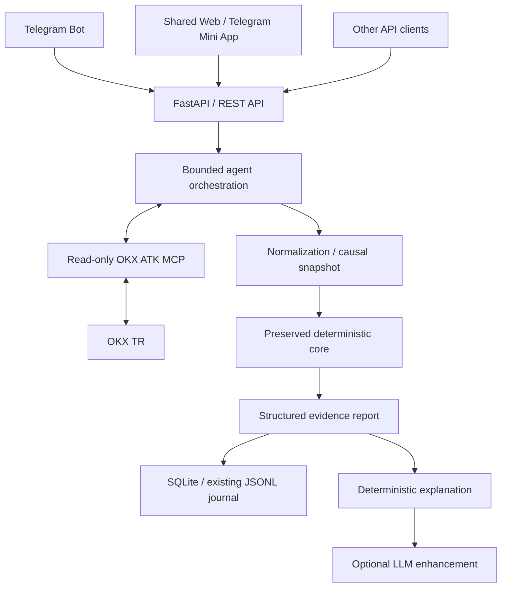

# Product MVP v0.1 — Hackathon Scope Freeze

Status: **APPROVED PRODUCT SCOPE — DOCUMENTATION ONLY; IMPLEMENTATION NOT STARTED**.
Date: 2026-09-12. Chapter: **Ch.0 — Base Setup / Product Re-Scope**.
Integration branch: `strategy-v0.1`.
Base checkpoint: `364a3a7d50024520065e74a9c9e9da899d4e3897`.
Sources: [U-PRODUCT-001] and [U-RUBRIC-001], the user's formal Ch.0 closure
instruction; see [SOURCE_REGISTRY](../SOURCE_REGISTRY.md).

This freezes product requirements, not trading algorithms or an API schema.
The existing Python application, tests, dependencies and runtime configuration
are preserved. All product components below are planned unless explicitly
identified as existing. Ch.1 requires a separate, explicit user approval after
review of this closure.

## A. Product vision

Evolve the existing project into an **open-source, self-hosted, agentic market
intelligence / trading copilot**. Preserve the deterministic trading core and
its causal evidence. Telegram is an optional interface; the same application
services must be usable from the browser, REST API and potentially another
agent/MCP interface later.

The product answers a market question with real OKX data, an evidence report,
an honest deterministic result and an understandable explanation. It must
distinguish observed facts, implemented intelligence, unavailable modules,
candidate setups, acceptance/risk approval and execution.

## B. Target user

A trader or market researcher who wants an inspectable personal assistant,
usable on a phone or browser and deployable locally or on a VPS. The first
release is a small personal/self-hosted application, not a hosted multi-tenant
exchange, wallet or portfolio-management platform.

The user should not need a Telegram account, exchange trading credentials or
an LLM subscription to obtain a useful public-market report through the web/API.
Internet access to OKX remains necessary for live data. An optional external
LLM must have a disclosed data boundary and must not be required for startup.

## C. Hackathon value proposition

One request, such as "Analyze BTC", retrieves market information, organizes
4H / 1H / 15m evidence, displays the chart and explains the result and its
limitations. Previous analyses remain inspectable at their original knowledge
times. The user can see why a setup is unavailable or why a supported candidate
still has no execution permission.

The differentiator is inspectable evidence and causal availability, combined
with a useful shared mobile/web experience. A data pipeline alone is not a
completed strategy, and neither a green test suite nor an LLM explanation proves
profitability. Before the final demo, P0.5 requires real, narrow deterministic
market intelligence rather than a permanent unconfigured-strategy placeholder.

## D. Judging rubric mapping

The following weights are user-confirmed hackathon requirements [U-RUBRIC-001],
not an independently verified public rules page or a prediction of awarded points.

| Criterion | Weight | Build / show | Acceptance evidence |
|---|---|---|---|
| Functional Utility & Value | 30% | A useful BTC report, evidence, history and a narrow pre-demo intelligence slice | A user answers a market question and understands the actionable limitations |
| User Experience & Interaction | 30% | Shared web/Mini App, chart, readable result, explanation and complete loading/error states | The same flow works on a phone and normal browser |
| ATK MCP Integration Depth | 20% | Actual backend MCP calls whose results feed normalization, snapshots and reports | Traceable ticker/candle/orderbook inputs and their uses in the analysis |
| System Reliability & Safety | 10% | Closed-candle causality, freshness, read-only tools, failure gates and tests | An intentional data failure produces a visible safe result and no order |
| Innovation & Uniqueness | 10% | Time-qualified evidence, then-known analysis history and inspectable decision reasons | Users can identify what was known, missing and required at each evaluation |

Prioritize useful end-to-end delivery and UX. Validate runtime MCP early;
avoid architecture perfection, redundant tools and framework migration.

## E. User journeys

| Journey | Minimum behavior |
|---|---|
| Analyze BTC | Select BTC-USDT or ask "Analyze BTC"; receive real market data, chart, result, reasons and module availability |
| Inspect evidence | Open the evidence section; inspect symbol, timeframe, closed-candle knowledge boundary, provenance and data times |
| Understand WAIT / NO TRADE | Read deterministic reasons and missing conditions; supported state labels require the approved intelligence contract, and unavailable intelligence remains explicit |
| Review previous analysis | Open History and retrieve the original stored report without recomputing it using future data |
| Open through Telegram Mini App | Use the bot launcher to open the shared application; validate Telegram identity at the API boundary |
| Open through normal browser | Use the same application without Telegram; public-market analysis remains available with the configured web access policy |

LONG, SHORT, WAIT, NO_VALID_SETUP and candidate labels describe intended future
presentation possibilities, not current Python enums or approved trading rules.
The present core returns `NO_TRADE / STRATEGY_NOT_CONFIGURED`. Do not rename that
placeholder to WAIT or NO_VALID_SETUP and claim that intelligence is implemented.
Loading, stale and error statuses are operational UI states, not market direction.

## F. MVP architecture



| Component | Boundary / responsibility | State at Ch.0 |
|---|---|---|
| Telegram Bot | Thin launcher/request interface; communicates through product API; optional notifications later | Not implemented |
| Telegram Mini App / Web | One React/Vite/TypeScript frontend where practical; Telegram-specific integration only at the interface boundary | Not implemented |
| FastAPI | Validated requests, access policy, analyses/history and health/readiness | Not implemented |
| Agent orchestration | Bounded workflow and validated read intents; invokes application services and tools without owning market/risk truth | Not implemented |
| Deterministic Core | Existing `agent_trading` replay, immutable MTF histories, decision chain and intent-only SHADOW; approved intelligence added later | Foundation exists; real strategy absent |
| ATK MCP | Backend-owned MCP client and actual toolkit process/session; exchange normalization outside domain logic | Product runtime MCP not implemented; current adapter uses ATK CLI |
| SQLite / JSONL | SQLite for immutable analysis reports/history; preserve existing JSONL audit/error records | JSONL exists; SQLite not implemented |
| Explanation layer | Deterministic/template explanation first; optional LLM wording cannot alter authoritative fields | Product explanation not implemented |
| Self-hosting | Lean Docker Compose deployment, persistent data, optional Telegram and production HTTPS | Not implemented |

The intended domain chain remains data → snapshot/state/patterns → context →
decision → acceptance → risk → execution, with evidence logging. Product
services wrap this core; no framework migration or unrelated refactor is needed.
Application services should later be callable by our own MCP wrapper without
embedding Telegram or HTTP concerns in trading logic.

Before parallel implementation, Codex defines and Claude reviews the shared
API contract. It must cover analysis identity, instrument, schema/version,
knowledge time, live observation times, freshness, facts, module availability,
deterministic results/reasons, evidence references, explanation and sanitized
tool provenance. Exact routes, schemas and enums are a Ch.1 deliverable.

Preserve Decimal internally and serialize price/quantity values exactly as
strings at the API boundary. A chart's display conversion must not feed numeric
floats back into the domain core. Serialize mutable engine work per symbol;
avoid concurrent evaluation of the same engine. Keep the initial worker and
persistence model simple.

## G. P0 / P0.5 / P1 / P2 scope

All entries here are required or optional future deliverables, not claims of
completion at this documentation checkpoint.

| Priority | Deliverables | Dependency / gate |
|---|---|---|
| P0 | Shared product API contract; real runtime ATK MCP; BTC analysis endpoint; live ticker/candles/orderbook report; shared Web/Mini App Analysis screen; Lightweight Charts; deterministic explanation; History; SQLite; Telegram launcher/bot; Docker Compose; loading/error/stale/missing-module states | Explicit Ch.1 approval; API contract before parallel work; early application-runtime MCP smoke |
| P0.5 — before final demo | At least one narrow, meaningful, honest deterministic market-intelligence slice with evidence-backed WAIT, NO_VALID_SETUP or properly supported candidate behavior | A specifically approved algorithm/spec, source provenance, causal availability and expected fixtures; not satisfied by UI relabeling or data-quality status alone |
| P1 | ETH; user-defined watch conditions; opt-in Telegram notifications; approved Range/Deviation intelligence; optional LLM explanation enhancement | P0 usable; each intelligence/watch behavior specified; no silent trading semantics |
| P2 | Authenticated balance read; advanced replay UI; proper shadow-position lifecycle; our own MCP server | Remaining time, working auth where needed, approved accounting/simulation or interface contract |

First intended intelligence sequence: **Market Structure → Range → Deviation →
LTF confirmation/context**. A narrow P0.5 slice does not authorize a complete
MarketStructureEngine or bypass its N-1–N-7 gates. Resolve the necessary
definitions and approve source-labelled causal fixtures before coding the slice.
If this cannot be completed, record P0.5 as unmet; never fabricate a signal.

Advanced Manipulation, Momentum, Distribution, SMT/SSMT, Quarterly Theory,
advanced order-flow and advanced portfolio management are postponed. Momentum /
Distribution and the other explicit non-goals are outside this frozen MVP;
extra time does not silently expand scope.

Relative execution order:

| Stage | Objective / deliverable | Dependencies | Relative effort / parallel work |
|---|---|---|---|
| Ch.1 start | Freeze API contract and validate real runtime MCP → normalized core input | Closure review and explicit Ch.1 approval | Medium/high technical risk; Codex owns, Claude reviews contract |
| P0 vertical slice | BTC API/report/history plus shared Analysis/History UX | Shared contract; MCP proof for real-data integration | High; backend and frontend develop in separate worktrees |
| P0 delivery | Telegram launcher, Compose, freshness/errors and template explanation | API/UI slice; bot token and reachable HTTPS for Telegram | Medium; Claude owns Telegram, Codex integration/Compose |
| P0.5 | Implement and test one approved intelligence slice before final demo | Approved causal algorithm and fixtures | Potentially high; one core owner, frontend maps approved output |
| P1 / P2 | Add highest-value optional workflow only after mandatory gates pass | Completed preceding gates and time | Variable; reserve final time for tests, clean install and rehearsal |

## H. Minimum Telegram UX

Only two main screens: **Analysis** and **History**. A symbol selector replaces
a separate Markets screen; evidence, result and explanation are sections of
Analysis. Settings can be a small panel. Do not add a Shadow Position screen
before a proper position model exists.

Analysis includes symbol, operational market-data status, one candle chart,
4H / 1H / 15m selector, freshness and `as_of`, deterministic result, evidence,
template explanation and explicit errors/missing modules. Distinguish closed
candles from separately observed live ticker/book information. Use readable
mobile typography, accessible state labels, loading progress and retry behavior.

The initial bot supports a start/launcher flow and a BTC analysis request.
It delegates to the API; it contains no strategy, risk or exchange-order code.
The Mini App opens the shared application. Telegram theme/session integration
must not be necessary for normal browser use. Validate signed `initData` and its
age server-side before identity-dependent operations; do not trust
`initDataUnsafe`. Production Mini App launch requires a reachable HTTPS URL.

## I. ATK MCP workflow

Highest early Ch.1 technical risk:

**Application runtime → MCP client → OKX Agent Trade Kit → real
ticker/candles/orderbook → normalized core input.**

Use actual product-runtime MCP, preferably the official local toolkit with
`site=tr`, market-only modules and read-only mode. Public reads should not
depend on account authentication. Codex/Claude MCP registration, desktop OAuth,
CLI success or fabricated tool traces do not establish this acceptance gate.

| Read | Contribution |
|---|---|
| `market_get_ticker` for BTC-USDT | Observed live price/market facts, with observation time and provenance |
| `market_get_candles` for 4H / 1H / 15m | Historical bootstrap and closed, chronological histories; existing normalization and immutable MarketSnapshot feed the core and chart |
| `market_get_orderbook` for BTC-USDT | Descriptive best bid/ask, spread and limited depth; no unapproved order-flow strategy |

Fix the candle evaluation `as_of`; reject open/future candles and preserve
symbol/timeframe separation. Live ticker/book reads have their own observation
times and must not be injected into a past candle decision as then-known input.
Use one report to connect each tool result to the corresponding facts/evidence.
Do not force redundant calls just to increase call counts.

Expose sanitized tool name, instrument/timeframe, transport, observation time,
duration, outcome and analysis correlation in a data-source/evidence detail.
Never expose auth headers, tokens, credentials or unrestricted raw error output.
Keep the existing CLI adapter as the verified foundation/reference; any future
fallback must identify its transport and cannot be presented as MCP success.

## J. Safety model

- READ-ONLY / SHADOW first. LIVE execution is outside the current MVP; no usable
  live enable switch or exchange write tool may enter the application path.
- Closed-candle causality and no look-ahead remain mandatory. Preserve UTC,
  Decimal, immutable snapshots, `swing_time` versus `confirmed_at`, and
  source-confirmed versus empirically validated status.
- Freshness distinguishes request observation age from each timeframe's
  expected latest closed bar. A normal old 4H close is not stale merely because
  a ticker has a shorter freshness requirement. Operational tolerances must be
  explicit; they are not permission to invent trading thresholds.
- Missing/malformed/conflicting required data fails closed, with visible errors
  and no candidate execution. Set bounded timeouts and read-only recovery;
  do not silently use cached data as live. Avoid duplicate analysis/intent work.
- Current Acceptance/Risk placeholders cannot approve trades. A future supported
  candidate is distinct from risk approval and execution authorization.
- Premium/Discount remains context/confirmation, not an entry trigger. EQ
  reaction/reclaim is not universally mandatory. Preserve DD ordinary HTF side
  blocks and all unresolved integration rules [U-PD-001], [D-DD-MSB-001].
- Preferred explanation flow: deterministic report → deterministic/template
  explanation → optional LLM enhancement. LLMs may orchestrate validated reads
  and explain, but never determine or override prices, structural state,
  deterministic strategy results, risk approval or execution authorization.
- Keep secrets out of Git, frontend assets, model inputs and logs. Validate
  Telegram/web access at the API boundary; initial self-hosting is personal use.
- Validate the existing 36-test baseline plus meaningful new contract, MCP
  normalization, stale/error, explanation-boundary and UI integration checks
  during implementation. Tests prove conformance, not profitable trading.

## K. Self-hosting model

Target eventual setup after prerequisites and local configuration:

```sh
git clone <project-url>
cd <project-directory>
cp .env.example .env
docker compose up -d
```

The goal is **one easy start command**, not necessarily one container. Prefer a
lean Compose application with API/shared frontend, a toolkit process or internal
MCP service as appropriate, persistent data, optional Telegram service/profile
and HTTPS support for a VPS. A local stdio MCP child in the backend container is
a simple starting option; avoid extra network/database infrastructure by default.

No Dockerfile, Compose file, `.env.example`, new dependency or product README
quickstart is implemented by Ch.0. They are P0 deliverables. Plan a clear sample
environment for site/mode, data location and optional Telegram/LLM settings.
Default public-market web/API output works without private OKX credentials,
Telegram or an LLM. Optional services must not block core startup.

Document Docker prerequisites, Linux/macOS and Windows configuration steps,
local/VPS URLs, health/readiness, persistence/backup and common startup failures.
Use development reload separately from production builds; pin versions actually
validated during Ch.1. Ignore/exclude real `.env` and runtime data from Git and
image build contexts; never bake host credential stores into an image.
Open-source delivery also needs a project license and dependency notices.

## L. Demo flow

1. Open the Telegram bot, launch the Mini App and analyze BTC.
2. Show real MCP-backed price, closed MTF candles, chart and freshness.
3. Show the implemented P0.5 intelligence result, its evidence and deterministic
   explanation. A supported WAIT/NO_VALID_SETUP is valid; fake LONG/SHORT is not.
4. Inspect which ATK calls supplied the report and why a candidate is blocked or
   absent. Missing modules remain visible.
5. Open a previous analysis at its original `as_of`.
6. Demonstrate an intentional read failure/stale condition and no order.
7. Open the same application in a normal browser and show the simple local/VPS
   installation and health checks.

A recorded OKX-data fallback may support rehearsal/outage recovery, but it must
be labelled recorded with the original knowledge time. It does not count as a
live runtime MCP success. Do not fabricate market states or historical profits.

## M. Definition of Done

Ch.0 documentation freeze checklist (the final two operations follow this
document's commit; inspect Git metadata and the final closure report for their
actual completion, without inserting a self-referential commit hash here):

- [x] Deterministic foundation checkpoint.
- [x] Real OKX shadow-data pipeline.
- [x] Shared Codex/Claude memory system.
- [x] Product direction approved.
- [x] Hackathon MVP scope frozen.
- [x] Product architecture documented.
- [x] Agent responsibilities defined.
- [ ] Final Ch.0 checkpoint commit.
- [ ] Clean worktrees created from that checkpoint.

Product/demo acceptance is separate and **not completed at Ch.0**:

- [ ] API contract reviewed before parallel implementation.
- [ ] Actual product-runtime MCP public reads feed normalized core input.
- [ ] BTC report, chart, template explanation and persistent History work.
- [ ] Shared Analysis/History work in Telegram Mini App and a normal browser.
- [ ] Loading/error/stale/missing-module states work and remain honest.
- [ ] P0.5 approved deterministic intelligence slice works with causal fixtures;
      final demo is not merely STRATEGY_NOT_CONFIGURED relabelled as WAIT.
- [ ] Read-only/SHADOW boundaries and relevant tests pass with zero real orders.
- [ ] Clean Compose installation, persistent data and health checks work;
      Telegram/LLM remain optional.
- [ ] Demo rehearsed, evidence traceable, recorded fallback labelled.

Chapter model: Ch.0 — Base Setup / Product Re-Scope; Ch.1 — Product MVP & UX;
Ch.2 — Trading Intelligence; Ch.3 — Agent Workflows; Ch.4 — Validation & Demo.
MCP validation belongs at the start of Ch.1; P0.5 intelligence must arrive before
the final demo even though its conceptual chapter is Ch.2. Safety starts with
the first vertical slice, not only at Ch.4.

Codex owns backend, runtime MCP adapter, FastAPI, core integration, persistence,
backend tests and Compose/integration. Claude owns React/Vite/TypeScript,
Mini App UX, Telegram bot/interface and frontend tests. Shared contract and root
integration/memory files have one owner, Codex, with Claude review. Trading
intelligence core files have one owner at a time.

Use `strategy-v0.1` as integration branch. After its documentation checkpoint
commit and clean status, create `work/copilot-backend` and `work/copilot-ux` in
separate sibling worktrees from the exact checkpoint. Preserve any existing
branches/worktrees and report them instead of recreating or destroying them.
Creation is setup only: leave both clean and do not start either agent's work.
Ch.1 starts only after the user explicitly approves the reviewed Ch.0 closure.

## N. Explicit non-goals

No LIVE trading or usable live toggle; no full portfolio management, SMT/SSMT,
Quarterly Theory, Momentum/Distribution, framework migration or unapproved
trading algorithm. No fabricated structural levels, Range/Deviation labels,
confidence/trend scores, risk approval, fills or PnL. No mandatory EQ entry,
Telegram dependency in the domain core, mandatory LLM, multi-tenant platform,
unnecessary queue/database framework or tool calls solely for judging optics.

This closure changes documentation and Git setup only. It installs no packages,
changes no Python behavior, creates no tag/remote, performs no push and stops
before product implementation.
